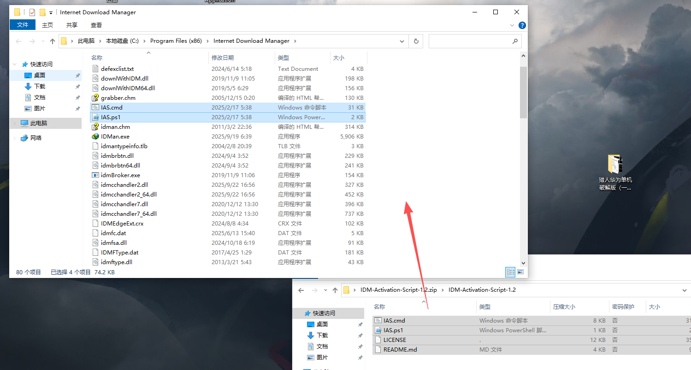
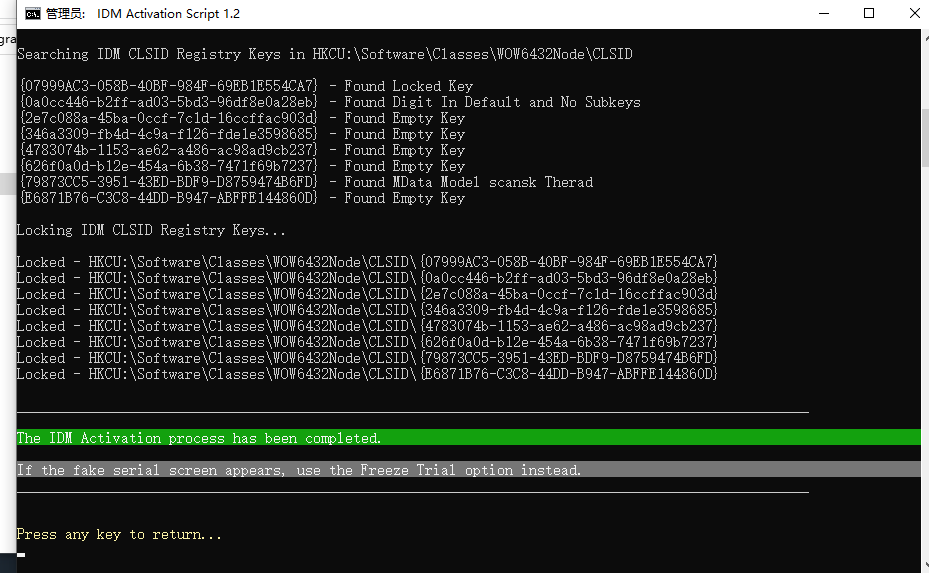
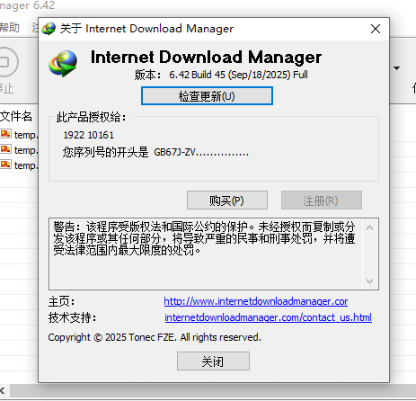

# IDM（Internet Download Manager）

## 免责声明

本站所有的软件均来自网络，逆向教程仅用于学习和交流，请在软件下载24小时内删除

## 介绍

IDM是一款功能强大的下载管理软件，它可以帮助用户加速下载速度、恢复中断的下载、管理下载任务以及组织文件。IDM支持HTTP、FTP、HTTPS、HTTP2等协议，并能与大多数浏览器集成，提供无缝的下载体验。

**官方售价**：83.95元/年（单台）185元/永久（单台）
69.95元/年（两台每台）140元/永久（两台每台）

**支持平台**：Windows

## 下载

下载链接：[请点击此处](https://www.internetdownloadmanager.com/download.html)

## 白嫖教程

本软件使用以下项目进行破解

::github{repo="lstprjct/IDM-Activation-Script"}

### （一）、下载并安装*

下载链接：[https://www.internetdownloadmanager.com/download.html](https://www.internetdownloadmanager.com/download.html)

下载完安装包后 一路确定即可安装成功

打开关于我们发现版本显示**未注册**

### （二）、下载破解脚本*

下载链接：[https://github.com/lstprjct/IDM-Activation-Script/releases](https://github.com/lstprjct/IDM-Activation-Script/releases)

选择最新版本的补丁下载

### （三）、使用破解补丁*

将下载到的文件解压到文件根目录

运行**IAS.cmd**脚本

**输入1进入激活模式** 根据提示进行确定操作

### （四）、检查IDM是否已被激活

**再次打开关于页面 查看是否被激活**

看到序列号就说明已经被完美激活

**根据实测 此激活版本可正常更新 但非常不建议这么做**

## 温馨提示

没事别更新！没事别更新！没事别更新！

本篇文章已被收录至[自用软件合集！](https://chuzoux.top/posts/software/#IDM)中