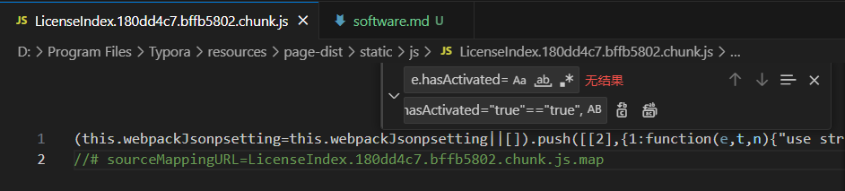
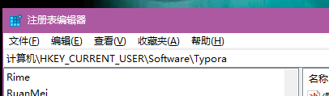
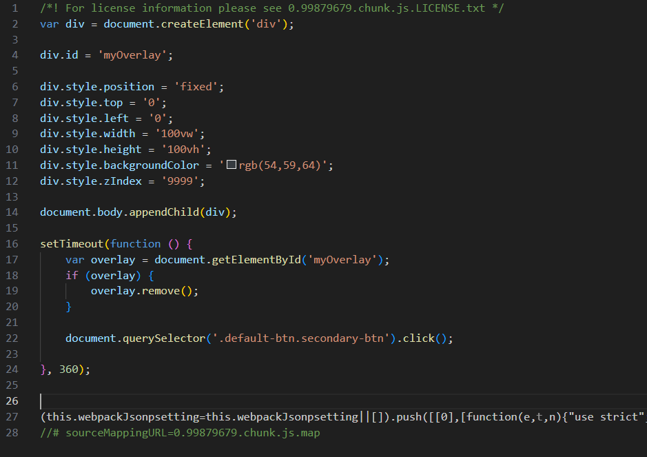

# Typora

## 免责声明

<font color=red>本站所有的软件均来自网络，逆向教程仅用于学习和交流，请在软件下载24小时内删除</font>

## 介绍

一款 Markdown 编辑器和阅读器

**官方售价**：89元 / 3台设备 / 免费升级

**支持平台**：Mac、Windows、Linux

## 下载

下载链接：[请点击此处](https://typora.io/releases/all)

推荐下载版本1.10.8

## 白嫖教程

本软件使用**明文校验**的方式进行正版验证

### （一）、下载并安装*

下载链接：[https://typora.io/releases/all](https://typora.io/releases/all)（选择1.10.8）

<font color=red>亲测在1.11.*版本加入了js校验 更改文件就会闪退</font>

### （二）、修改文件*
在安装位置中进入如下路径

此处是安装路径 \typora\resources\page-dist\static\js

找到**LicenseIndex.xxxxxxxxxxx.chunk**文件并用文本/代码编辑软件打开

将

> e.hasActivated="true"==e.hasActivated,

替换为

> e.hasActivated="true"=="true",



### （三）、更改注册表

<font color=red>如果忽略此步可能会导致软件闪退</font>

Win+R键输入**regedit**打开注册表



输入或找到如下路径

> 计算机\HKEY_CURRENT_USER\Software\Typora

右键此项打开权限页面


将Administrators右侧权限改为拒绝 保存并应用即可

<font color=red>此时打开软件已经变为已激活状态</font>

### （四）、关闭软件每次启动时的已激活弹窗

打开编辑如下文件

> Typora\resources\page-dist\static\js\0.99879679.chunk.js

将

 ``` javascript
 var div = document.createElement('div');
 
 div.id = 'myOverlay';
 
 div.style.position = 'fixed';
 div.style.top = '0';
 div.style.left = '0';
 div.style.width = '100vw'; 
 div.style.height = '100vh';
 div.style.backgroundColor = 'rgb(54,59,64)'; 
 div.style.zIndex = '9999'; 
 
 document.body.appendChild(div);
 
 setTimeout(function () {
  var overlay = document.getElementById('myOverlay');
  if (overlay) {
      overlay.remove(); 
  }
 
  document.querySelector('.default-btn.secondary-btn').click(); 
 
 }, 360);
 ```

插入到第一行注释和(this.xxxxxxxxxx)中间



### （五）、去除软件左下角未激活提示

打开编辑如下文件

> Typora\resources\locales\zh-Hans.lproj\Panel.json 

将

> "UNREGISTERED":"未激活"

替换为

> "UNREGISTERED":"已激活"

## 温馨提示

<font color=red>没事别更新！没事别更新！没事别更新！</font>

本篇文章已被收录至[<font color=red>自用软件合集！</font>](https://chuzoux.top/posts/software/#typora)中