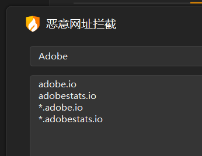
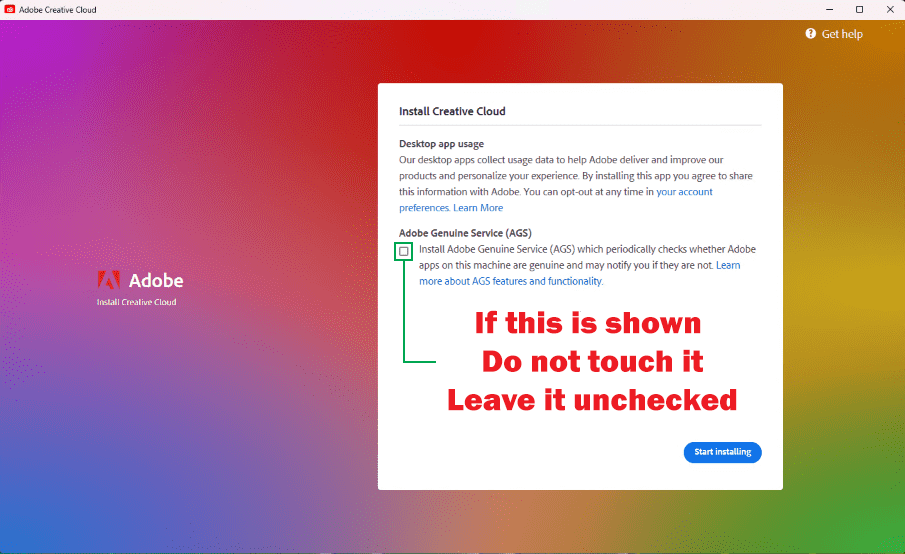
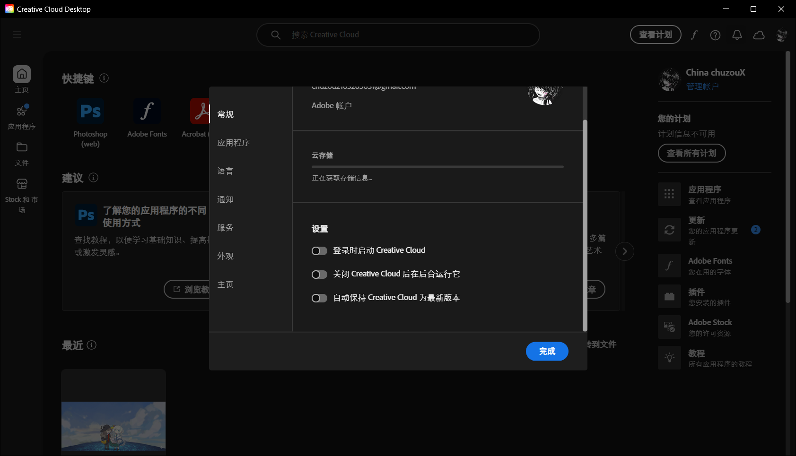
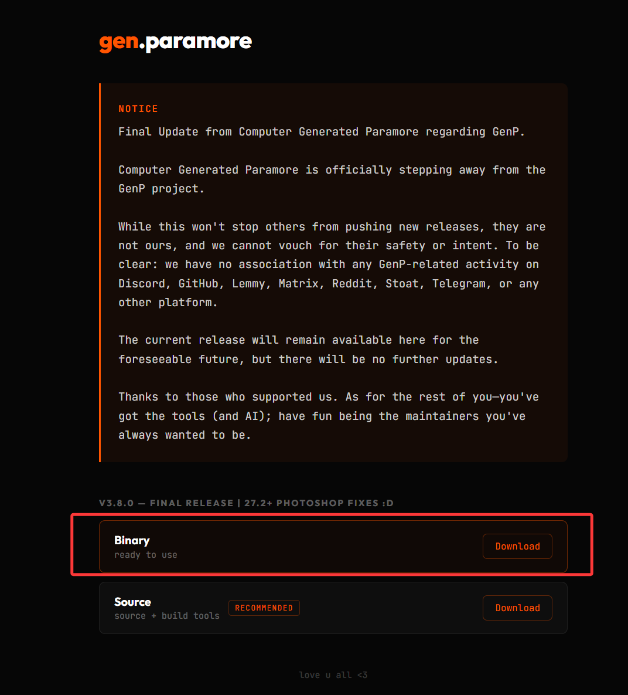
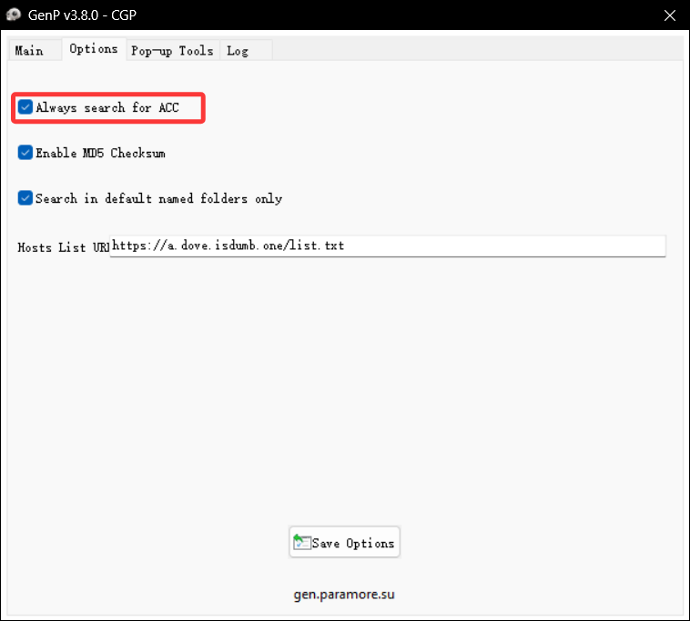
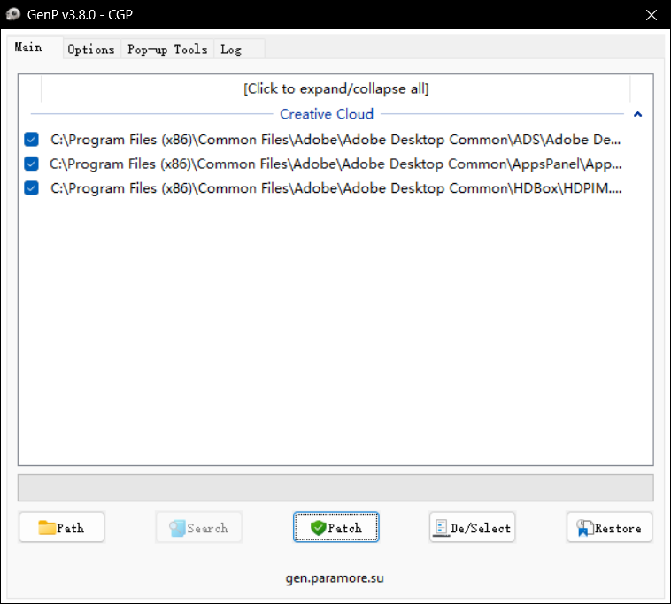
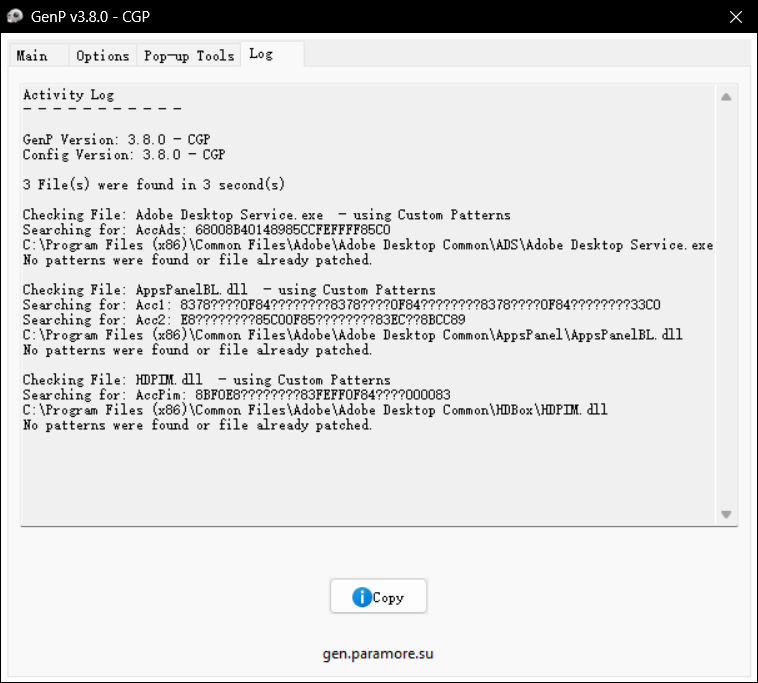
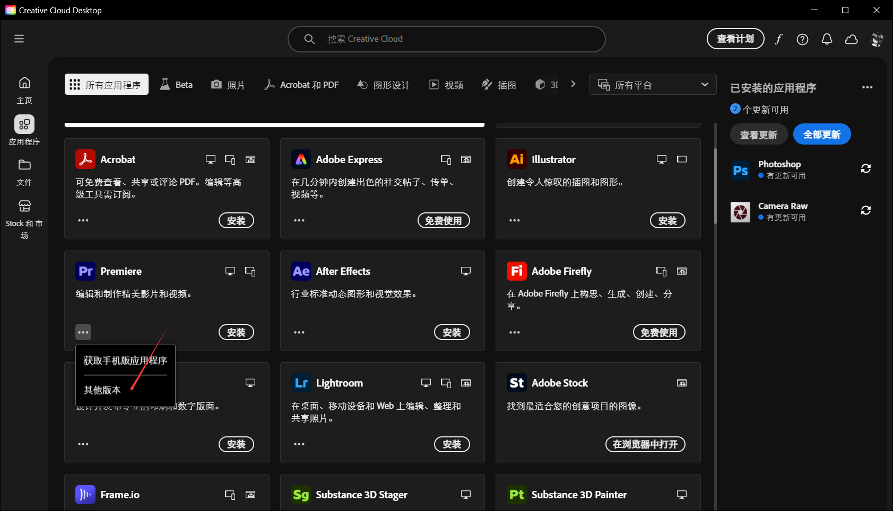
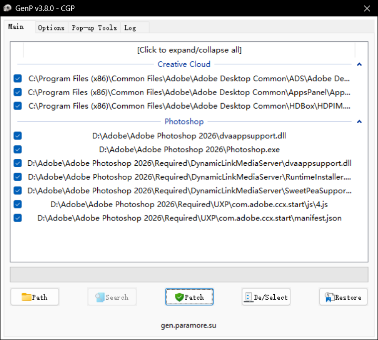

# Adobe全家桶 Adobe在天上失禁地看着GenP 可以直接从Adobe Creative Cloud更新！！

## 前言

之前装过一个离线的Photoshop 2023版本，不过后来用的时候提示 
`# This unlicensed Adobe app is not genuine and will be disable`

类似于这样的一个页面
尝试禁用adobe相关域名的网络 但是只维持了几天

仍出现`THIS APP HAS BEEN DISABLED`的提示 点击后直接崩溃
然后我就去找一些教程 尝试了很多教程都没有办法缓解
知道我看见这一条评论

>下载一个Adobe GenP-v3.7.1.exe，就可以完美解决，我用了Up的方法，还有其他方法都不行，就这个玩意找到对应文件夹，然后点Search，然后点Path一下，就完事了，实测有效。有需要私信我。

经过实验发现 GenP 破解有以下优点

- 可以在Adobe Creative Cloud更新
- 所有标准内容包 和 工具均默认通过官方安装程序下载
- 拥有完善的wiki与社群
- 由于采用手动控制，大多数人认为它更安全
- 非常适合完整的 Adob​​e 套件和多个应用程序
- 软件开源

于是就有了这篇文章

## GenP教程

:::Caution

 **GENP 完全免费**

GenP 从设计之初就完全免费，并且一直如此。GenP 本身不接受任何捐赠，也不要求任何捐款，因为让所有人都能使用这个项目是我们的核心原则。任何与 GenP 官方相关的人员都不会要求为该工具支付任何费用或接受任何捐赠。

GenP社区的官方运作平台是Lemmy和Stoat，GenP Wiki是唯一可信的下载和文档来源。这些平台直接链接到官方GenP Wiki，以避免镜像和重新上传造成的混乱。

不幸的是，GenP经常被第三方盗用，他们以自己的名义重新上传，通常还会捆绑广告、虚假下载管理器、弹窗、调查问卷，甚至恶意软件。这些上传行为的唯一目的就是利用GenP的流行度来获取流量和利润。

:::

:::Important

这篇文章根据 GenP-v4.0.0.exe 编写，由于软件仍在更新，很多东西可能已经无法使用，请以官方wiki最新内容为主

:::

### 适用设备

 **GenP 和 Monkrus 兼容性 – 仅支持部分 Windows 版本**

**GenP 仅支持 Adob​​e 官方支持的基于 x64 的 Windows 10 和 Windows 11 版本。**

**Monkrus 可在基于 x86 和 x64 的 Windows 10 或 11 系统上运行（取决于版本），但可能会绕过某些安装程序端的检查，以牺牲稳定性和兼容性为代价。**

**GenP 和 Monkrus 均不支持 ARM64、IoT、LTSC 或修改或精简的 Windows 版本。**

由于 GenP 和 Monkrus 的工作原理是直接修改 Adob​​e 应用程序，因此所有 Adob​​e 官方系统要求仍然适用。不受支持的 Windows 版本（例如 IoT、LTSC、ARM64 或高度定制的版本）无论激活状态、更新补丁或 ESU 使用情况如何，均不受支持。

### 兼容性列表

>官方最新列表：[https://wiki.dbzer0.com/genp-guides/compatibility-list/](https://wiki.dbzer0.com/genp-guides/compatibility-list/)

 **通用版本 (GA) 应用 (x86/x64)**

**这是稳定版本，目前所有受 GenP 支持的用户均可使用。**

:::details 

- Acrobat `v25.1` (Latest: `v25.001.21265`)
- After Effects `v26.0`
- Audition `v26.0`
- Bridge `v16.0.2`
- Camera Raw `v18.2.1`
- Character Animator `v26.0`
- Creative Cloud `v6.8.1.865`
- Dimension `v4.1.8`
- Dreamweaver `v21.7`
- Illustrator `v30.2.1`
- InCopy `v21.2`
- InDesign `v21.2`
- Lightroom Classic `v15.2`
- Media Encoder `v26.0`
- Photoshop `v27.4`
- Photoshop Elements `≥v26.0` (Latest: `v2026.2` - `Build: 20251121.PSE.e62dc8f8`)
- Premiere Elements `≥v26.0` (Latest: `v2026.1` - `Build: 20251104.PRE.65345cd3`)
- Premiere Pro `v26.0.1`
- Substance 3D Designer `v15.1.2`
- Substance 3D Modeler `v1.22.6`
- Substance 3D Painter `v11.1.3`
- Substance 3D Sampler `v5.1.3`
- Substance 3D Stager `v3.1.8`

:::

 **GenP (x86/x64) 不支持的通用版本 (GA) 应用**

**GenP 不再支持这些 GA 应用。部分应用可能仍可运行且仍可通过补丁修复，因为它们尚未从 GenP 中移除。其他应用现在可以免费使用，不再需要补丁，而部分应用的支持已停止。我们将不再提供任何帮助或支持。**

:::details 

- Aero `v0.24.4`（已停产/生命周期结束 - 已于 2025 年 11 月 6 日从 Creative Cloud 中移除；服务器已于 2025 年 12 月 3 日关闭）
- Animate`v24.0.12`（维护模式；无新功能；仅进行安全和错误修复更新；仍对新老用户可用）
- Express Photos （Adobe，原名 Photoshop Express。基础 CC 版本；可能通过 Microsoft Store`v3.24.4`自动更新）`≥v3.28`
- Fresco `v5.7.0`（所有版本`≥v5.7.0`均可免费使用，无需打补丁；仅`≤v5.5.5`可使用以下方式打补丁`GenP v3.4.2`）
- Lightroom`v9.2`
- Maxon Cinema 4D `v2026.1.3`（所有版本`≥v2024.3.2`，使用免费的 C4D Lite 许可证；仅`≤v2024.2.0`支持版本补丁`GenP v3.4.13.4`）
- Premiere Rush `v2.10`（已停止服务；不再向新用户开放。2026年9月30日之后将完全停止支持）
- UXP开发者工具`v2.2.1`（无需打补丁）
- XD `v60.0.12`（`GenP v3.4.2`仅限补丁程序）（已停止更新；不再向新用户提供。现有用户只有在加入 Creative Cloud Pro 计划后才能获得维护和错误修复更新。）

:::

### 第一步：下载Adobe Creative Cloud

Adobe Creative Cloud下载链接

🔗 **[Creative Cloud (CC)](https://www.adobe.com/download/creative-cloud)** - Adob​​e 下载 -_请始终优先使用此版本_ 
🔗 **[Creative Cloud (CC)](https://helpx.adobe.com/download-install/apps/download-install-apps/creative-cloud-apps/download-creative-cloud-desktop-app-using-direct-links.html)** - Adob​​e 替代下载 -_如果您在使用 Adob​​e 下载时遇到问题，请使用此下载方式_ 
🔗 **[Creative Cloud (CC)](https://www.mediafire.com/file/jfpyan2768pmxdb/Creative_Cloud_Set-Up.exe/file)** - 备份下载 -_仅当您上述两个 Adob​​e 下载都出现问题时才使用。_ 

然后正常根据引导下一步即可（直接登录自己的Adobe账号）

:::Warning

如果显示 -**请勿安装 Adob​​e 正版服务 (AGS)** - 如果未显示，请继续。

:::

安装完毕之后 打开Adobe Creative Cloud

在 `文件>首选项>常规>设置`中关闭所有

### 第二步：下载GenP最新版本

打开下载链接：[https://gen.paramore.su/](https://gen.paramore.su/) 直接下载最新版本

直接下载二进制文件即可 若不放心可与选择source自行构建

### 第三步：破解Adobe Creative Cloud

先关闭Adobe Creative Cloud进程 然后打开GenP 
在Options中打开`Always search for ACC`

先点`Path`找到下载Adobe Creative Cloud的目录（到Adobe目录即可） 
然后再点击`search`进行搜索

搜索完之后全选 然后点击`patch`破解 
等待跑完进度条之后 会自动转跳到Log 

最后打开Adobe Creative Cloud发现购买按钮已经变成了下载按钮

此时Adobe Creative Cloud已被破解
### 第四步：下载对应版本软件

>提示：在`文件>首选项>应用程序>正在安装`位置可以修改安装目录

在Adobe Creative Cloud找到对应软件 但是不要直接下载 
在[兼容性列表](#兼容性列表)中 先找到对应软件查看支持版本

在`其他版本`中下载对应版本

### 第五步：使用GenP解锁软件

打开GenP 在`path`中找到你下载软件的目录（依旧到adobe目录即可）

然后直接全选进行`patch`读条 结束后依旧展示Log 

关闭GenP 打开软件即可完成解锁

### **阻止不必要的 Adob​​e 后台进程 (PS/DC)**

>这里引用官方的wiki内容

**除了这里提到的那些之外，不要阻止其他后台进程，阻止其他后台进程既不建议也不必要。**

**注意：** 在现代设备上，这些后台进程通常不会影响性能，因此通常无需重命名。本指南主要面向使用旧设备的用户或因 Adob​​e 后台进程而遇到性能问题的用户。如果您仍然希望阻止这些进程，请按照以下说明操作。

_感谢 Verix_

**适用于 Photoshop：**

:::details 

你只需要重命名这四个`.exe`文件即可。

1. `C:\Program Files (x86)\Adobe\Adobe Sync\CoreSync\CoreSync.exe`
2. `C:\Program Files\Adobe\Adobe Creative Cloud Experience\CCXProcess.exe`
3. `C:\Program Files (x86)\Common Files\Adobe\Adobe Desktop Common\ADS\Adobe Desktop Service.exe`
4. `C:\Program Files\Common Files\Adobe\Creative Cloud Libraries\CCLibrary.exe`

只需`.bak`在句点后添加即可`.exe`。

例如：`CoreSync.exe`-->`CoreSync.exe.bak`

（如果文件名中看不到`.exe`扩展名，您需要在资源管理器中启用文件扩展名显示。）

:::

**适用于 Acrobat DC：**

:::details 

你只需要重命名这个`.exe.`文件即可。

1. `C:\Program Files\Adobe\Acrobat DC\Acrobat\AdobeCollabSync.exe`

只需`.bak`在句点后添加即可`.exe`。

例如：`AdobeCollabSync.exe`-->`AdobeCollabSync.exe.bak`

（如果文件名中看不到`.exe`扩展名，您需要在资源管理器中启用文件扩展名显示。）

:::

⚠️**用于安装和更新：**

:::details 

要在 Creative Cloud 中执行任何新安装或更新，您必须至少还原以下名称更改：

`C:\Program Files (x86)\Common Files\Adobe\Adobe Desktop Common\ADS\Adobe Desktop Service.exe`

此文件是 Creative Cloud 的核心服务，用于管理安装和更新流程。如果重命名或禁用此文件，安装和更新将失败或被阻止。

当使用 GenP 对 CC 进行修补时，`.bak`会创建一个与原始未修改版本相同的文件副本。请勿删除此`.bak`文件，因为它是唯一无需修复或重新安装 CC 即可恢复的未修改版本。

如果您之前`.exe`为了阻止更新而重命名了已打补丁的文件，请在安装或更新之前将该已打补丁的文件名恢复原名`Adobe Desktop Service.exe`。除非已打补丁的版本已丢失，否则不要直接重命名该`.bak`文件`.exe`，因为这会将 CC 恢复到未打补丁的状态。

**警告：** 恢复`.bak`文件会将已打补丁的版本替换为原始版本，这意味着 CC 将不再打补丁。如果执行此操作，则必须在完成安装或更新后使用 GenP 重新为 CC 打补丁。

如果原始文件丢失或损坏，请使用 CC 应用卸载工具将其恢复，然后再重新安装 CC。此过程在“故障排除”部分的“CC 应用错误”中有详细说明。

为了完全兼容并防止与其他 Adob​​e 应用程序出现安装或更新问题，请`.exe`在继续操作之前将所有重命名的文件恢复为原始名称。

:::

## 相关链接

下载链接：[https://gen.paramore.su/](https://gen.paramore.su/) 
官方wiki：[https://wiki.dbzer0.com/genp-guides/guide](https://wiki.dbzer0.com/genp-guides/guide) 
官方社群：[https://lemmy.dbzer0.com/c/GenP](https://lemmy.dbzer0.com/c/GenP)

## 温馨提示

没事别更新！没事别更新！没事别更新！

本篇文章已被收录至[自用软件合集！](https://chuzoux.top/posts/software/#adobe)中

