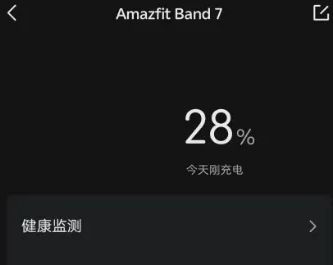
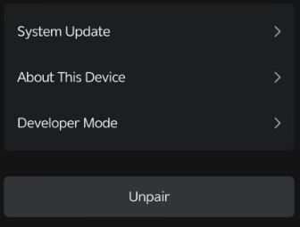
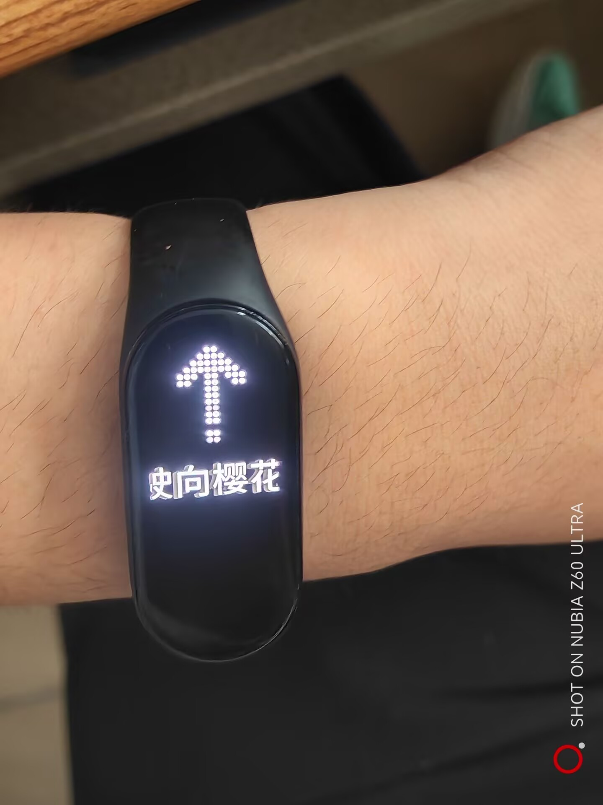

# 小米手环7联动ZeppOS应用

## 前言

ZeppOS小程序是一套可以通过ZeppApp与手机和云端进行联动的完整链条。

ZeppApp是**华米**旗下的APP

虽然不支持连接小米手环，但在俄罗斯大佬的改版中 项目组通过魔改ZEPP应用将小米手环7（Mi band 7）作为华米手环7（Amazfit band 7）与手机连接

## 使用Zepp连接小米手环

1. 下载zepp**改版**

   下载链接如下：

   - [123云盘](https://www.123865.com/s/gTXKjv-sk5Wd?pwd=8IOA)
   - [mega](https://mega.nz/file/T1wRHLLb#q4LYPrs6c2vpAdMfkYk8rMXry-d1vl0cIsdJYR_ihrQ)

2. 找到手环的蓝牙地址

   打开**小米运动健康**或**zepp life**找到手环的蓝牙地址并记录下来

   复制以下链接

   Zepp（华米）：

   https://api-watch.huami.com/forwarding/watchUS?redir=7800&mac=蓝牙地址&pnpNumber=117&pnpVersion=259

   Zepp life或小米运动健康：

   https://hlth.io.mi.com/download?redir=7800&mac=蓝牙地址&pnpNumber=103&pnpVersion=256

   修改链接使它与你的手环蓝牙地址匹配

   每次恢复出厂设置后，蓝牙地址会改变。

   例如你的蓝牙地址为：

   > C3:DE:8A:5F:76:9B

   在链接中你应该填写为

   > C3DE8A5F769B
   >
   > https://api-watch.huami.com/forwarding/watchUS?redir=7800&mac=C3DE8A5F769B&pnpNumber=117&pnpVersion=259
   > 
   > https://hlth.io.mi.com/download?redir=7800&mac=C3DE8A5F769B&pnpNumber=103&pnpVersion=256

   注意：去掉蓝牙地址中间的冒号

3. 生成二维码并扫描绑定

   打开任意一个生成二维码的网站（例如：草料二维码），输入你修改蓝牙地址后的华米链接

   生成二维码并使用Zepp绑定

   

4. 打开开发者选项

   在资料>设置>关于页面

   连续五次点击Zepp图标 就有提示进入了开发者模式

   原版官包也可以绑定，但是不能使用开发者模式，会提示“Bluetooth channel is not available. Please try again later.”

   打开绑定的手环 下滑看见开发者选项就可以了

   

5. 找到app-side应用安装二维码

   这边有一个安装app-side的网站

   https://ze.mmk.pw/

   此网站内的部分软件可以完美兼容

   这边举个例子：
   **Navigation Wear** （只支持Google Map）

   我这边测试的版本是**1.3.3**完美兼容 而这个网站上的**1.9.4**会有图标显示问题

   具体其他应用需要自己自行测试

   这边提供一个**1.3.3**的安装二维码

   

6. 安装app-side应用

   在开发者选项中右上角找到扫描

   扫描对应安装二维码 即可安装成功

## 使用截图

## 注意事项

理论来讲 使用zepp的app-side服务可能需要有zepp在后台辅助

但zepp无法在手环中添加卡片 如出现类似不支持的问题请切换回zepp life或小米运动健康解决

若出现无法连接的问题 请使用Zepp life或小米运动健康对应链接形成的二维码进行新的绑定

---

参考文献 ：https://www.coolapk.com/feed/42561142 
