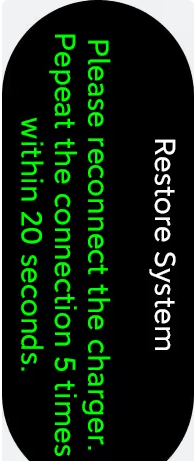
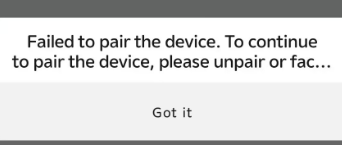
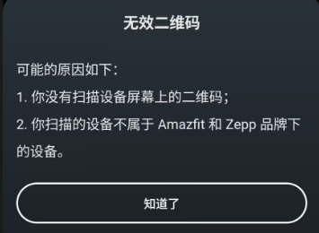
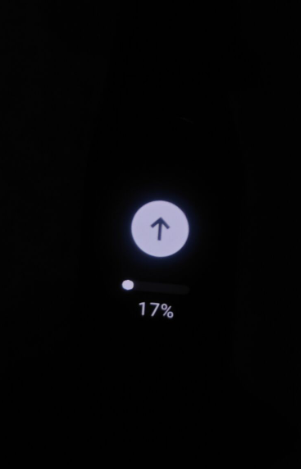

# 修复小米手环7 系统损坏进入rec后无法绑定手机

## 前言

今年年初 本人高三在校生 为了使校园生活变的不再那么枯燥

我将大量的小说通过**环间电子书**导入到了**小米手环7**上 然后没过多久就出现了问题

我在打开小程序的同时 手环多次重启 进入了rec页面

根据步骤来就进入了**清除数据页面** 清除数据后 它会给你**提供一个二维码** 让你绑定手机

当你扫码在绑定设备时 它会提示 **“此设备已被另一个设备绑定 请先解绑”**

但事实上**当你解绑后也无法进行绑定**

## 解决思路

### 连接手机思路

我们在重置了系统后 出现了无法绑定的问题

问题的源头来自**手机app检测到手环里有绑定手机的信息**

也就是说 **我们把手环上绑定信息去除后 我们就可以进行绑定设备**

### 信息清除数据

在遇到问题时 我也收集了许多的方法 但很多方法都已经失效

但我了解到了一关键的一点 强行绑定

在小米手环app的早期版本 存在**强行绑定**的情况 只不过后来被官方封堵了

不过也侧面说明了此方法的可行性 也就是说**我们只要强行绑定之后 再进行解绑 清除了绑定手机的信息 就可以完成新设备的绑定**

温馨提示：解绑的原因是强行绑定会出现问题

可强行绑定的方式被封堵了 有什么其他方法进行强绑吗

### 转机

**华米** 现已更名为（“[Zepp Health](https://www.google.com/search?cs=1&sca_esv=e3cd531e34091613&sxsrf=AE3TifMpPjVan28a3eDHGvMAdiZZ-JG3yQ%3A1757083852275&q=Zepp+Health&sa=X&ved=2ahUKEwivxtG278GPAxU2k68BHYyLNiQQxccNegQIAhAB&mstk=AUtExfDVlP8fThlF90Puag29EN_tLTUBw8jX63Rf5g2Bii7XgS09eNlu4pBik-syeoE3A5hFhfhzSiOSep6TKgSQXgab0L5YbPHYx7k8XcikwplCUbigAGLTgnxZA_u7hDITVNJPJ2pcgE97jbfi2iAQUQEIx_qrXI7fsWnOTl3Sl9CfCTA&csui=3)”）曾是小米生态链企业，为小米生产智能穿戴产品，如小米手环。但双方关系已渐行渐远，华米主要依靠自有品牌 [Amazfit](https://www.google.com/search?cs=1&sca_esv=e3cd531e34091613&sxsrf=AE3TifMpPjVan28a3eDHGvMAdiZZ-JG3yQ%3A1757083852275&q=Amazfit&sa=X&ved=2ahUKEwivxtG278GPAxU2k68BHYyLNiQQxccNegQIBBAB&mstk=AUtExfDVlP8fThlF90Puag29EN_tLTUBw8jX63Rf5g2Bii7XgS09eNlu4pBik-syeoE3A5hFhfhzSiOSep6TKgSQXgab0L5YbPHYx7k8XcikwplCUbigAGLTgnxZA_u7hDITVNJPJ2pcgE97jbfi2iAQUQEIx_qrXI7fsWnOTl3Sl9CfCTA&csui=3) 和 [Zepp](https://www.google.com/search?cs=1&sca_esv=e3cd531e34091613&sxsrf=AE3TifMpPjVan28a3eDHGvMAdiZZ-JG3yQ%3A1757083852275&q=Zepp&sa=X&ved=2ahUKEwivxtG278GPAxU2k68BHYyLNiQQxccNegQIBBAC&mstk=AUtExfDVlP8fThlF90Puag29EN_tLTUBw8jX63Rf5g2Bii7XgS09eNlu4pBik-syeoE3A5hFhfhzSiOSep6TKgSQXgab0L5YbPHYx7k8XcikwplCUbigAGLTgnxZA_u7hDITVNJPJ2pcgE97jbfi2iAQUQEIx_qrXI7fsWnOTl3Sl9CfCTA&csui=3) 进行独立运营，并推出了独立的健康管理应用 [Zepp Life](https://www.google.com/search?cs=1&sca_esv=e3cd531e34091613&sxsrf=AE3TifMpPjVan28a3eDHGvMAdiZZ-JG3yQ%3A1757083852275&q=Zepp+Life&sa=X&ved=2ahUKEwivxtG278GPAxU2k68BHYyLNiQQxccNegQIBBAD&mstk=AUtExfDVlP8fThlF90Puag29EN_tLTUBw8jX63Rf5g2Bii7XgS09eNlu4pBik-syeoE3A5hFhfhzSiOSep6TKgSQXgab0L5YbPHYx7k8XcikwplCUbigAGLTgnxZA_u7hDITVNJPJ2pcgE97jbfi2iAQUQEIx_qrXI7fsWnOTl3Sl9CfCTA&csui=3)，而小米也推出了自家的官方应用《小米运动健康》。目前，二者在穿戴设备领域属于合作伙伴与竞争对手并存的复杂关系。

**华米**旗下的APP **zepp**（并不是zepp life）虽然不支持连接小米手环，但在俄罗斯大佬的改版中 项目组通过魔改ZEPP应用将小米手环7（Mi band 7）作为华米手环7（Amazfit band 7）与手机连接

注意：这个连接没有设备绑定验证 也就是所谓的强行绑定

## 操作

1. 下载zepp**改版**

   下载链接如下：

   - [123云盘](https://www.123865.com/s/gTXKjv-sk5Wd?pwd=8IOA)
   - [mega](https://mega.nz/file/T1wRHLLb#q4LYPrs6c2vpAdMfkYk8rMXry-d1vl0cIsdJYR_ihrQ)

2. 用改版的zepp扫码绑定

   直接用zepp APP扫描手环上的二维码

   

   

   绑定后 在app内会显示如下内容

   

   此时 我们可以发现**Mi band 7被检测为了Amazfit band 7**

   然后我们直接点击**解绑设备**即可

   注意：此步会清除手环中的绑定信息

   绑定失败问题：

   ​	

   可能原因：未使用改版后的zepp

3. 使用zepp life绑定

   扫描手环上的二维码 我们可以发现此时手环可以被绑定了

   同样是这个界面

   

   此时 手环还处于不可用状态

4. 检查更新修复系统

   找到检查更新界面 我们可以发现有一个新的更新（这个更新可能被rec后就有 不确定）

   

   

   我们直接进行更新 等待手机将固件推送到手环中

   

   安静等待读条完成 就可以进入被重置后的新系统了！！！

   enjoy~

（后续恢复出厂设置/绑定新设备等功能均不受影响）

---
参考文献 ：https://www.coolapk.com/feed/42561142  
		   https://www.bandbbs.cn/threads/12135/