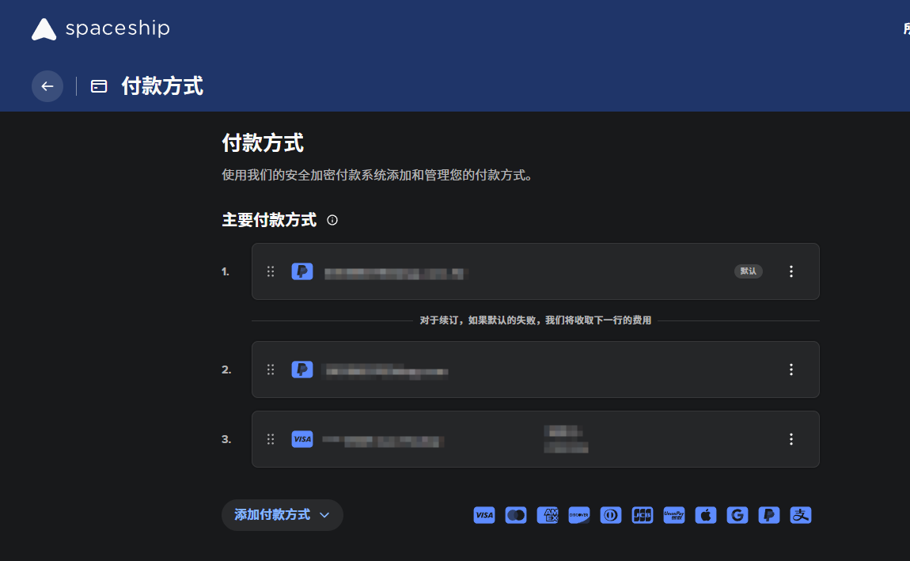
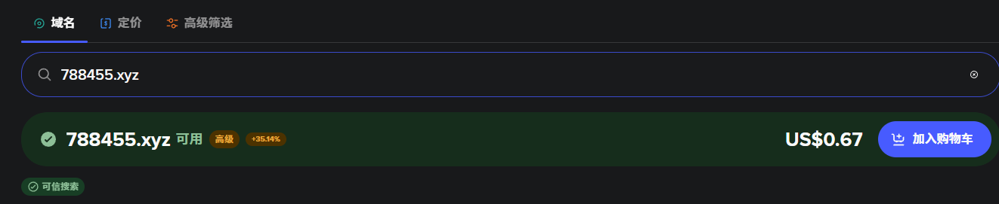
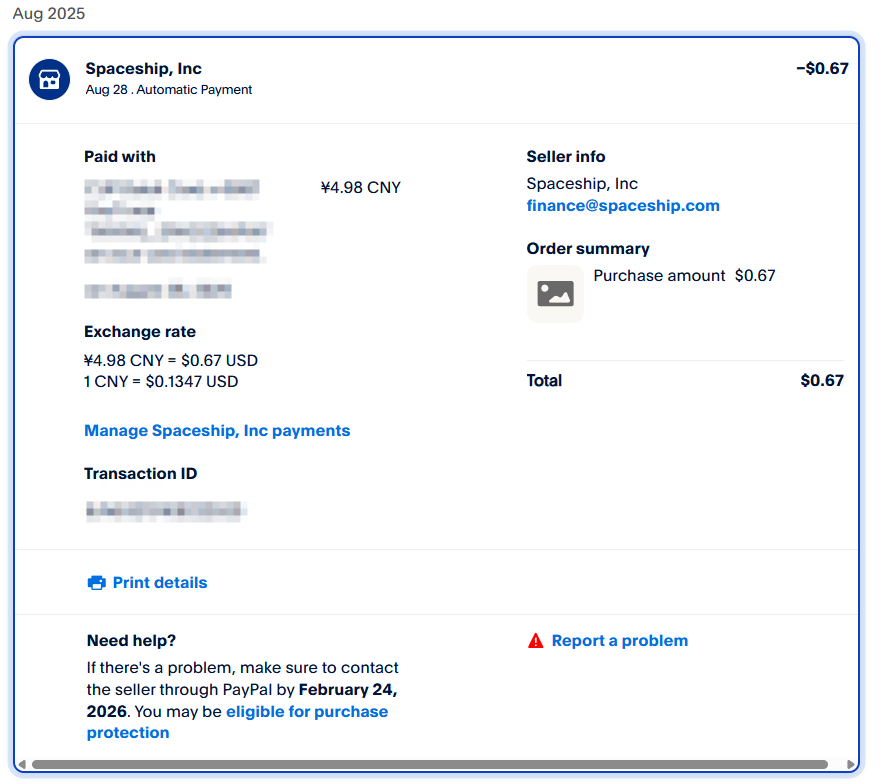
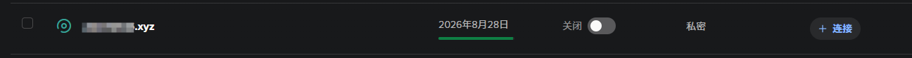
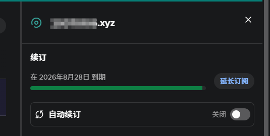
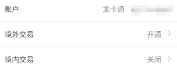
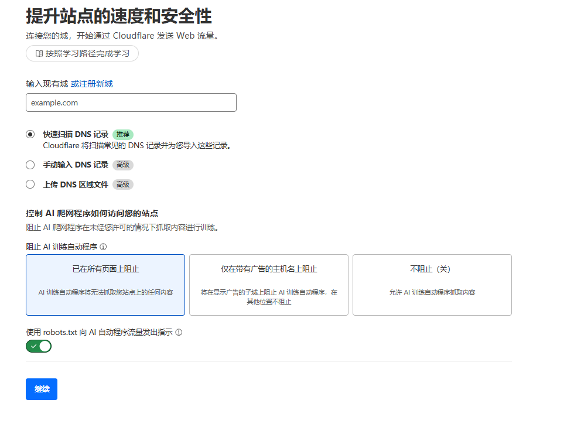
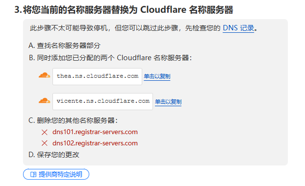
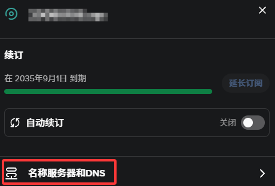

# 不到50元拿下十年.xyz域名（银联卡即可）

## 前言

25年7月底刷到了一篇关于spaceship域名低价的帖子，原文写到

> xyz域名促銷，6-8位數數字的。xyz一年 0.67美金，最多可以買一年之後再續九年，總共十年 6.7美金

当时没太注意 前两天去做cf的ip优选时 突然想起来了这次的活动 于是就去试了试

补充：原文下有一条这样的评论

> （6位到9位數字）的 .xyz 域名，從2017年開始官方定價就是 USD$1/y，另外不同註冊商可能有不同優惠，Spaceship 的價格常態就是 $0.67，不算是什麼特價吧

不管是不是活动 无伤大雅 5r/year的价格还是蛮香的 值得入一手

本次能够参与活动的域名为 **6位到9位數字.xyz**  美观性差点意思 可以用作其他用途（包括但不限于ip优选）

## 支付方式

spaceship支持的支付方式有很多

- visa
- MasterCard
- JCB
- discover
- AMEX
- 银联
- 虚拟货币
- PayPal（支持国区）
- Google Pay
- Apple Pay
- 支付宝

国内建议直接尝试支付宝和银联卡

我支付宝不常用 于是尝试去绑定银联卡 但是提示**拒绝服务**

如果你也用同样的情况 可以尝试**用PayPal绑定银联卡** 然后**在网站上绑定PayPal**解决

## 域名挑选与购买

打开[spaceship官网](https://www.spaceship.com/)

在 **search for a domain name** 输入你想要的域名 一定是6-9位数字+.xyz

例如 我们搜索788455.xyz

添加购物车 我们可以发现目前只能**购买一年** 直接用你绑定的支付方式进行支付

成功扣款**4.95** 如果卡内余额过低，也有可能会提示余额不足扣款失败

打开域名管理器就可以找到购买的域名了

然后我们点击此域名 找到右侧延长订阅的地方 直接购买即可

这边最大延长时间是**9年** 再加上我们刚开始注册域名的**1年** 一共是**10年**

依旧直接用绑定付款方式进行付款

扣款成功 **44.6** 人民币

总计价格 **4.95 + 44.6 = 49.55 元 ≈ 0.67 + 6.03 = 6.7 美元**

返回域名管理器就可以发现域名已经续费到**10年**后了

## 【问题】拒绝付款

遇到拒付问题，可以登录你所用卡的APP或者支付APP，查看是否有信息推送

一般情况下，出现拒绝付款要么就是卡里没钱 要么就是未开通境外支付

我们只需打开官方app 在消息中找到境外开通页面 按流程开通即可

我们再次付款就可以发现**支付成功**了

## 域名托管到cloudflare【可选】

建议将域名统一托管到cloudflare平台 方便管理

打开cloudflare官网 添加现有域 

选择**免费计划**

最后他会给你两个名称服务器

将这两个服务器填写到 域名管理→名称服务器和dns

将提供的两个服务器填入

返回**cloudflare检测**即可

## 结语

有什么关于本文章的任何问题 欢迎在文章最后评论
